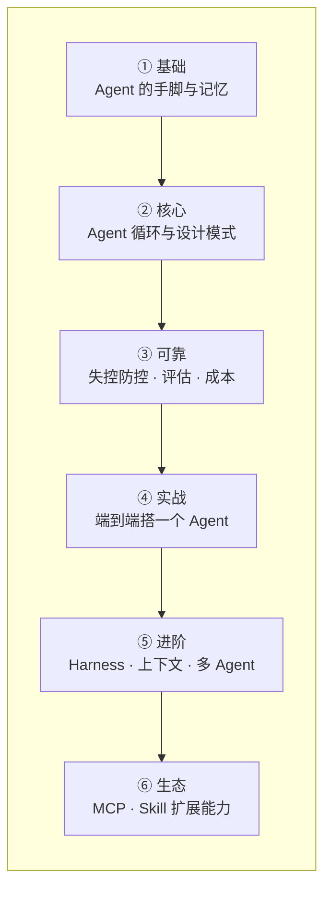

# Agent 学习路径

关于 AI Agent 的内容，在这份指南里是按"先打基础 → 再建模式 → 落地实战 → 进阶生态"分布在第 1/2/4/5 章的，没有挤在单独一章。这一页把它串成一条路，**专门想学 Agent 的话，照这条线走就行**。

> 💡 这是一张"导航地图"，不是新内容——每一站都链到正文对应小节。建议第一遍按顺序走通，落地时再回到具体小节深挖。

---

## ① 基础：Agent 靠什么动起来

Agent = 会自己调工具、能记住上下文的 LLM。先把这两块底座搞清楚。

- [1.4 Tool Use 深度使用](/ch1-llm-engineering/tool-use) — 工具调用是 Agent 的"手脚"，没有它 Agent 只能说不能做
- [1.5 多轮对话与状态管理](/ch1-llm-engineering/conversation) — 消息历史是 Agent 的"短期记忆"，决定它记得住多少

## ② 核心：Agent 循环与设计模式

理解 Agent 到底是怎么"自己转起来"的，以及常见的几种组织方式。

- [2.3 Agent 设计模式](/ch2-build-products/agent-patterns) — Agentic Loop、ReAct、Planning、Handoff、Guardrails，含「最小 ReAct Agent」可跑实战 ⭐

## ③ 可靠：让 Agent 不失控、可衡量

能跑起来不算完，能稳定、可评估、成本可控才敢上线。

- [2.4 为什么 Agent 会失控](/ch2-build-products/agent-failure) — 失控的几种模式、怎么诊断、怎么设计成不容易失控
- [2.5 AI 系统的评估方法](/ch2-build-products/evaluation) — 用数字判断 Agent 好坏，而不是"碰运气调 Prompt"
- [2.8 成本估算实操](/ch2-build-products/cost-estimation) — Agent 多步调用很烧钱，先算清楚账

## ④ 实战：从零搭一个完整 Agent ⭐

把前面的东西拼成一个真能用的东西——这是整条路的落地里程碑。

- [2.11 实战项目：知识库问答 Agent](/ch2-build-products/capstone) — 检索作为工具 + Agent 循环 + 评估 + 上线三关，端到端走一遍

## ⑤ 进阶：决定 Agent 上限的工程功夫

同样的模型，为什么有人的 Agent 又稳又能干长任务？差距在这三节。

- [4.8 Agent = Model + Harness](/ch4-agent-mcp/harness-engineering) — 脚手架工程的 7 个零件（控制流/错误恢复/反馈回路/计划追踪…）⭐
- [4.9 上下文工程](/ch4-agent-mcp/context-engineering) — 按需注入、压缩、隔离、用文件系统当外部记忆
- [4.6 多 Agent 协作](/ch4-agent-mcp/multi-agent) — Orchestrator-Subagent、Handoff、共享状态
- [4.7 AI 编程实战工作流](/ch4-agent-mcp/ai-coding-workflow) · [4.4 Claude Code 深度使用](/ch4-agent-mcp/claude-code) — 把 Agent 用在真实开发里
- [4.15 角色演进](/ch4-agent-mcp/engineer-roles) → [4.16 Graph 编排深入](/ch4-agent-mcp/graph-engineering) → [4.17 极简 Harness 解剖：Pi](/ch4-agent-mcp/pi-harness) — 从"带 AI 干活"到"设计 Agent 系统与工具"

## ⑥ 生态：给 Agent 接上更多能力

让 Agent 能用外部工具、封装可复用的能力。

- [4.1 MCP 是什么，为什么重要](/ch4-agent-mcp/) → [4.2 用现有 MCP](/ch4-agent-mcp/use-mcp) → [4.3 自己写 MCP](/ch4-agent-mcp/build-mcp) — 给 Agent 标准化地接外部能力
- [5.6–5.9 MCP 进阶](/ch5-deep-dives/mcp-capabilities) · [5.10–5.12 Skill](/ch5-deep-dives/skills-intro) — 能力的生产化与可复用封装

---

## 📌 关键结论

1. Agent 内容分布在第 1/2/4 章，主线顺序：**工具/记忆基础 → 循环与模式 → 可靠性 → 端到端实战 → Harness/上下文/多 Agent → MCP/Skill 生态**
2. 最小闭环只需 ①②④：搞懂 Tool Use + Agent 循环，就能跑通 [2.11 实战项目](/ch2-build-products/capstone)
3. 想做"能扛长任务、不跑偏"的 Agent，真正的功夫在第 ⑤ 步的 [Harness](/ch4-agent-mcp/harness-engineering) 和 [上下文工程](/ch4-agent-mcp/context-engineering)
4. 要给 Agent 扩外部能力，走 MCP/Skill 生态（第 ⑥ 步）

---

下一步：从 [1.4 Tool Use](/ch1-llm-engineering/tool-use) 开始，或直接跳到 [2.3 Agent 设计模式](/ch2-build-products/agent-patterns) 看循环怎么转。
