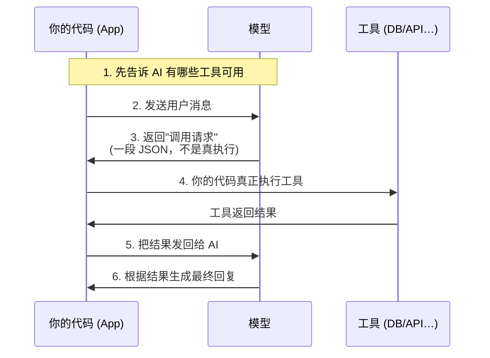

# 1.4 Tool Use 深度使用

Tool Use（也叫 Function Calling）是让 AI 能够调用外部工具的机制。这是构建 Agent 最核心的技术。

## 原理：AI 并不真的"执行"代码

很多人以为 Tool Use 是 AI 直接运行代码。**实际上完全不是这样。**

真实流程（注意：**真正执行工具的是你的代码，不是 AI**）：



> 💡 **类比**：AI 是一个下达命令的管理者，你的代码是真正做事的执行者。AI 说"去查一下数据库里有没有这个用户"，你的代码真正去查，然后把结果告诉 AI。

---

## 定义工具：Tool Schema

Tool Schema 是你告诉 AI"这个工具是什么、怎么用"的描述。

```javascript
// 定义一个查询天气的工具
const tools = [
  {
    name: "get_weather",
    description: "查询指定城市的当前天气。当用户问天气相关问题时使用。",
    input_schema: {
      type: "object",
      properties: {
        city: {
          type: "string",
          description: "城市名称，如'北京'、'上海'"
        },
        unit: {
          type: "string",
          enum: ["celsius", "fahrenheit"],
          description: "温度单位，默认 celsius"
        }
      },
      required: ["city"]
    }
  }
]
```

**关键：description 写好是成功的一半**

AI 靠 description 来判断什么时候该用这个工具。描述要清楚说明：
- 这个工具做什么
- 什么情况下用
- 不应该用于什么情况（如果有必要）

---

## 完整代码示例（Node.js）

```javascript
import OpenAI from "openai"

// 默认 DeepSeek 云端；本地 Ollama 切换方式见 1.4 节注释
const client = new OpenAI({
  baseURL: "https://api.deepseek.com",
  apiKey: process.env.DEEPSEEK_API_KEY
})
const MODEL = "deepseek-v4-flash"   // 本地可换 "qwen2.5:14b"（qwen 支持工具调用，gemma 不一定支持）

// 工具定义（OpenAI 兼容格式：用 type/function 包一层，参数字段叫 parameters）
const tools = [
  {
    type: "function",
    function: {
      name: "get_user",
      description: "根据用户 ID 从数据库查询用户信息",
      parameters: {
        type: "object",
        properties: {
          user_id: { type: "string", description: "用户的唯一 ID" }
        },
        required: ["user_id"]
      }
    }
  }
]

// 模拟数据库查询
function getUserFromDB(userId) {
  return { id: userId, name: "张三", email: "zhang@example.com" }
}

async function chat(userMessage) {
  const messages = [{ role: "user", content: userMessage }]

  while (true) {
    const response = await client.chat.completions.create({
      model: MODEL,
      max_tokens: 1024,
      tools,
      messages
    })

    const msg = response.choices[0].message

    // AI 没有要调用工具，返回最终回复
    if (!msg.tool_calls) {
      return msg.content
    }

    // AI 要调用工具：先把它这条回复（含 tool_calls）加入消息历史
    messages.push(msg)

    // 执行所有工具调用，把每个结果作为一条 role:"tool" 消息加回历史
    for (const call of msg.tool_calls) {
      let result
      if (call.function.name === "get_user") {
        const args = JSON.parse(call.function.arguments)  // 参数是 JSON 字符串，要先解析
        result = getUserFromDB(args.user_id)
      }
      messages.push({
        role: "tool",
        tool_call_id: call.id,
        content: JSON.stringify(result)
      })
    }
  }
}

const result = await chat("帮我查一下 user_123 的信息")
console.log(result)
```

---

## Structured Output：让 AI 只输出 JSON

当你需要 AI 输出固定格式的数据（而不是自然语言），有两个方式：

**方式一：在 Prompt 里说清楚**
```
请以 JSON 格式输出，格式如下：
{ "name": "...", "age": ..., "tags": [...] }
只输出 JSON，不要有其他文字。
```

**方式二：JSON Mode —— 强制输出合法 JSON**

在 OpenAI 兼容协议里加 `response_format`，模型会保证输出是能 `JSON.parse` 的合法 JSON：

```javascript
const res = await client.chat.completions.create({
  model: MODEL,
  // 提示里仍要说明你要的字段，并出现 "json" 字样
  messages: [{ role: "user", content: "提取这句话里的人名和年龄，用 JSON 返回：张三今年28岁" }],
  response_format: { type: "json_object" }
})
const data = JSON.parse(res.choices[0].message.content)  // { name: "张三", age: 28 }
```

**方式三：JSON Schema —— 连字段结构都锁死（更强，部分模型支持）**

不只是"合法 JSON"，而是强制符合你给的结构（字段名、类型、必填项都不会跑偏）：

```javascript
response_format: {
  type: "json_schema",
  json_schema: {
    name: "user_info",
    strict: true,
    schema: {
      type: "object",
      properties: {
        name: { type: "string" },
        age: { type: "number" },
        tags: { type: "array", items: { type: "string" } }
      },
      required: ["name", "age"],
      additionalProperties: false
    }
  }
}
```

> ⚠️ 三点注意：
> 1. **务必 try-catch `JSON.parse`**——即使开了 JSON Mode，极端情况（如被 `max_tokens` 截断）仍可能拿到半截 JSON。
> 2. **不是所有模型/厂商都支持 `json_schema`**，但 `json_object` 支持面较广；本地小模型可能两者都不支持，只能靠 Prompt 约束 + 解析兜底。
> 3. JSON Mode 解决"格式对不对"，解决不了"内容对不对"——字段值仍可能是幻觉。

---

## 为什么 Tool Use 会失败

常见原因：

1. **Description 写得不清楚** → AI 不知道什么时候该用这个工具，或者用错了
2. **参数设计太复杂** → AI 填参数时填错
3. **工具执行报错，没有把错误信息反馈给 AI** → AI 不知道出了什么问题，继续往下走
4. **工具太多** → AI 选错工具

---

---

## 🛠️ 实战练习：给 Tool Use 示例增加新工具

在上面的代码基础上，新增一个 `list_users` 工具，让 AI 能查询所有用户列表。

**步骤：**

1. 在 `tools` 数组里新增工具定义：
```javascript
{
  type: "function",
  function: {
    name: "list_users",
    description: "查询系统中所有用户的列表，返回 id 和 username",
    parameters: {
      type: "object",
      properties: {
        limit: {
          type: "number",
          description: "最多返回多少个用户，默认 10"
        }
      }
    }
  }
}
```

2. 在工具执行逻辑里加上处理：
```javascript
if (call.function.name === "list_users") {
  const limit = JSON.parse(call.function.arguments).limit || 10
  result = [
    { id: "user_001", username: "张三" },
    { id: "user_002", username: "李四" },
    { id: "user_003", username: "王五" },
  ].slice(0, limit)
}
```

3. 测试：`await chat("列出所有用户")`

**进阶挑战**：让 AI 先查列表，再根据 username 查某个具体用户的详情。这会触发 AI 连续调用两个工具，观察消息历史是怎么增长的。

---

## 📌 关键结论

1. AI 不直接执行代码，而是发出"调用请求"，由你的代码真正执行
2. Tool Schema 的 description 是核心，写清楚才能让 AI 正确使用工具
3. 工具执行失败时，要把错误信息返回给 AI，让它能调整
4. 工具数量不要太多，精选比大而全更好

---

下一节：[1.5 多轮对话与状态管理](./conversation)
