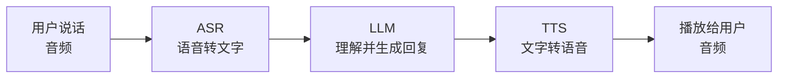

# 1.12 语音与实时：让 AI 能听会说

文字之外，AI 还能"听"和"说"。这一节讲三件工程上常用的事：把语音转成文字（ASR）、把文字读成语音（TTS）、以及把它们和 LLM 串成一个能对话的语音助手。

先建立一个最关键的认知——

> 💡 **类比**：语音对话不是一个"会说话的模型"，而是一条**流水线**：耳朵（ASR）→ 大脑（LLM）→ 嘴巴（TTS）。大多数场景下这是三个独立的模型/服务拼起来的。理解这条流水线，你就知道哪一环慢、哪一环错、哪一环花钱。



---

## ASR：语音转文字（让 AI 听懂）

最常用的一环。典型场景：会议纪要、语音输入、客服通话转写、视频字幕。

工程接入很简单——上传音频文件，拿回文字：

```javascript
import { readFileSync } from "fs"

// 以阿里百炼的语音识别为例（也可用本地 Whisper，见下文）
// 一次性识别（非流式）：把整段音频发过去，拿回整段文字
const BASE = "https://dashscope.aliyuncs.com/api/v1"
const res = await fetch(`${BASE}/services/audio/asr/transcription`, {
  method: "POST",
  headers: {
    "Authorization": `Bearer ${process.env.DASHSCOPE_API_KEY}`,
    "Content-Type": "application/json",
  },
  body: JSON.stringify({
    model: "paraformer-v2",                 // 通义的语音识别模型
    input: { file_urls: ["https://example.com/meeting.mp3"] },
  }),
})
console.log(await res.json())   // 含识别出的文字（长音频同样是提交+轮询的异步模式）
```

**本地方案**：[OpenAI 的 Whisper](https://github.com/openai/whisper) 是开源 ASR 标杆，可以完全本地跑，敏感音频（医疗、法务）不出本机。`whisper.cpp` 在普通笔记本上就能跑中等模型。

两种识别模式要分清：

- **一次性（整段）**：录完音再识别，简单，适合会议录音、语音留言转写
- **流式（边说边出字）**：通过 WebSocket 把音频分片实时推上去，边说边返回文字，适合直播字幕、实时语音输入。延迟低但接入复杂

---

## TTS：文字转语音（让 AI 开口）

反过来，把文字读成自然的语音。场景：有声书、播报、无障碍朗读、语音助手的"嘴"。

```javascript
import { writeFileSync } from "fs"

// 文字转语音：传文字 + 选音色，拿回一段音频
const BASE = "https://dashscope.aliyuncs.com/api/v1"
const res = await fetch(`${BASE}/services/aigc/tts/text-to-speech`, {
  method: "POST",
  headers: {
    "Authorization": `Bearer ${process.env.DASHSCOPE_API_KEY}`,
    "Content-Type": "application/json",
  },
  body: JSON.stringify({
    model: "cosyvoice-v1",
    input: { text: "你好，这是一段由 AI 合成的语音。" },
    parameters: { voice: "longxiaochun" },   // 选音色（每个平台有一批预置音色）
  }),
})
const buf = Buffer.from(await res.arrayBuffer())
writeFileSync("./output.mp3", buf)
```

工程上要关心的几个点：

- **音色（voice）**：每个平台有一批预置音色（不同性别、年龄、风格），选一个贴合你产品调性的
- **流式播放**：长文本别等整段合成完，用流式 TTS 边合成边播，否则用户要干等。这点和 [1.6 流式输出](./streaming-cost) 是一个道理
- **声音克隆**：部分平台支持用几句样音克隆特定音色——⚠️ 这是合规高敏感区，未经本人授权克隆他人声音有法律风险

---

## 实时语音对话：把三环串起来

把 ASR + LLM + TTS 串成一个能对话的语音助手，最朴素的做法就是顺着流水线走：录一句 → ASR 转文字 → 喂 LLM（[1.5 多轮对话](./conversation) 那套消息历史）→ 回复文字 → TTS 念出来。

```javascript
// 伪代码：一轮语音对话的骨架（省略各服务的具体调用）
async function voiceTurn(audioInput, history) {
  const userText = await asr(audioInput)                 // 1. 听：语音→文字
  history.push({ role: "user", content: userText })

  const reply = await llm(history)                       // 2. 想：LLM 生成回复
  history.push({ role: "assistant", content: reply })

  const audioOutput = await tts(reply)                   // 3. 说：文字→语音
  return { audioOutput, history }
}
```

> ⚠️ **延迟是实时语音的头号敌人**。三环串行相加，用户会明显感到"卡顿"。工程上的关键优化：① LLM 用**流式输出**，吐出第一句就立刻送去 TTS，不等整段；② TTS 也用**流式**边合成边播；③ ASR 用流式边说边转。把三段串行尽量变成**流水线并行**，体感延迟能从几秒压到一秒内。

对低延迟、强打断（用户能随时插话)要求高的场景，部分厂商提供**端到端实时语音 API**（一条 WebSocket 直接音频进、音频出，内部不暴露三段），接入更省心但灵活性低、也更贵。先用三段拼装把场景跑通，确有延迟瓶颈再考虑端到端。

---

## 🛠️ 实战练习：做一个"语音问答"小工具

把一段语音提问，转成文字、问 LLM、再把答案读出来——完整跑通流水线。

```javascript
import { readFileSync, writeFileSync } from "fs"
import OpenAI from "openai"

const dashHeaders = {
  "Authorization": `Bearer ${process.env.DASHSCOPE_API_KEY}`,
  "Content-Type": "application/json",
}
const BASE = "https://dashscope.aliyuncs.com/api/v1"

// 1. ASR：假设你已有一段提问音频的可访问 URL
async function asr(fileUrl) {
  const r = await fetch(`${BASE}/services/audio/asr/transcription`, {
    method: "POST", headers: dashHeaders,
    body: JSON.stringify({ model: "paraformer-v2", input: { file_urls: [fileUrl] } }),
  })
  const data = await r.json()
  return data.output?.text ?? JSON.stringify(data)   // 实际字段以平台返回为准
}

// 2. LLM：用 OpenAI 兼容协议问答（这里用文本模型）
const llm = new OpenAI({
  baseURL: "https://dashscope.aliyuncs.com/compatible-mode/v1",
  apiKey: process.env.DASHSCOPE_API_KEY,
})
async function answer(question) {
  const r = await llm.chat.completions.create({
    model: "qwen-plus",
    messages: [{ role: "user", content: question }],
  })
  return r.choices[0].message.content
}

// 3. TTS：把答案读成语音
async function tts(text) {
  const r = await fetch(`${BASE}/services/aigc/tts/text-to-speech`, {
    method: "POST", headers: dashHeaders,
    body: JSON.stringify({
      model: "cosyvoice-v1", input: { text },
      parameters: { voice: "longxiaochun" },
    }),
  })
  return Buffer.from(await r.arrayBuffer())
}

// 串起来
const question = await asr("https://example.com/my-question.mp3")
console.log("识别到的问题：", question)
const reply = await answer(question)
console.log("AI 的回答：", reply)
writeFileSync("./answer.mp3", await tts(reply))
console.log("已生成 answer.mp3")
```

**观察要点：**
- 整条流水线总共花了多久？哪一环最慢？
- ASR 识别口语、方言、专业名词时的错误，会怎样影响 LLM 的回答？（错字进、错答出）

**进阶挑战**：把 LLM 换成流式输出，每吐出一句话就立刻送 TTS 合成，对比"整段等完再念"的体感延迟差距。

---

## 📌 关键结论

1. 语音对话本质是 **ASR（听）→ LLM（想）→ TTS（说）** 的流水线，多数是三个独立服务拼起来
2. ASR 把语音转文字（会议纪要、字幕、语音输入），本地可用开源 Whisper 处理敏感音频
3. TTS 把文字读成语音，关键是选音色、用流式边合成边播；声音克隆是合规高敏感区
4. 实时语音的头号敌人是**延迟**——让 ASR/LLM/TTS 三环都走流式、并行流水线，把串行等待压到最短
5. 长音频识别和文生图一样常是"提交任务+轮询"的异步模式；强打断/超低延迟场景可考虑厂商的端到端实时语音 API

---

第 1 章完成。下一步：[第 2 章 · 构建 AI 产品](/ch2-build-products/)
