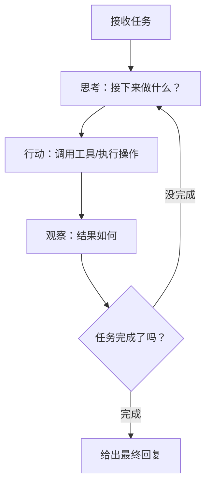

# 2.3 Agent 设计模式

Agent 是能够自主执行多步骤任务、使用工具的 AI 程序。这一节介绍几个核心设计模式。

## 什么是 Agentic Loop（Agent 循环）

普通的 AI 对话是"你问一次，AI 答一次"。Agent 则是：



这个"思考-行动-观察"的循环就是 **Agentic Loop**，也叫 **ReAct（Reasoning + Acting）** 模式。

---

## ReAct 模式

ReAct 是最基础的 Agent 模式，让 AI 交替进行"思考"和"行动"：

```
用户: 帮我查一下北京今天的天气，然后告诉我适不适合户外活动

AI 思考: 我需要查天气。调用 get_weather 工具。
AI 行动: get_weather("北京")
工具结果: 气温 25°C，晴天，UV 指数 6
AI 思考: 天气不错，我现在可以给出建议了。
AI 回答: 北京今天晴天 25°C，非常适合户外活动，但要注意防晒。
```

---

## Planning（规划）模式

对于复杂任务，先让 AI 制定一个完整计划，然后再执行。

```
用户: 帮我分析我们的用户增长数据，写一份报告

步骤1（规划）:
AI 输出完整计划:
  1. 从数据库查询过去 3 个月的新用户数量
  2. 按渠道分类统计
  3. 计算环比增长率
  4. 找出增长最快的渠道
  5. 生成折线图
  6. 撰写分析报告

步骤2（你确认计划）→ 步骤3（AI 执行）
```

**优点**：你可以在执行前检查计划是否正确，避免 AI 理解偏差后做了大量无用功。

---

## Multi-Agent（多 Agent 协作）

把复杂任务分给多个专门的 Agent，各自负责一部分，由一个 Orchestrator（协调者）统筹。

```
用户任务: 开发一个新功能

Orchestrator（总协调者）
  ├── Code Agent → 写代码
  ├── Review Agent → 代码审查
  ├── Test Agent → 写测试
  └── Doc Agent → 写文档
```

**你已经在用的工具里**：Claude Code 的 subagent 功能就是这个——主 Agent 把子任务委派给 Subagent 执行。

**适合的场景：**
- 任务可以并行执行
- 不同部分需要不同的专业能力
- 单个 Agent 上下文不够用

**风险：**
- 协调成本高
- 子 Agent 之间的信息传递可能丢失细节
- 调试更复杂

---

## Handoff（移交）

一个 Agent 完成它的部分后，把任务和上下文移交给下一个 Agent。

```
Agent A（负责收集信息）
  → 完成信息收集，整理成结构化数据
  → 把数据和任务说明移交给 Agent B

Agent B（负责分析）
  → 接收 Agent A 的输出
  → 进行分析，输出报告
```

**关键**：移交时要传递足够的上下文，让下一个 Agent 能直接开始工作，不需要重新理解整个任务。

---

## Guardrails（护栏）

在 Agent 的输入和输出上加检查层，防止问题内容进入或危险操作被执行。

```
用户输入
  ↓
[输入 Guardrail] 检查：是否包含敏感信息？是否有 Prompt Injection？
  ↓
Agent 处理
  ↓
[输出 Guardrail] 检查：输出是否合规？是否泄露了不该泄露的信息？
  ↓
返回给用户
```

**常见的 Guardrail 实现：**
- 用另一个 AI 模型来检查（便宜的模型就够）
- 规则检查（正则表达式、关键词过滤）
- 人工审核（高风险操作）

---

## 🛠️ 实战练习：写一个最小 ReAct Agent

基于 [1.4 Tool Use](/ch1-llm-engineering/tool-use) 的循环，做一个能自主多步调用工具的 Agent。给它两个工具，让它回答"北京今天适不适合户外活动"——它需要先查天气，再据此判断：

```javascript
// 复用 1.4 节的 client / MODEL / 工具调用循环
const tools = [
  {
    type: "function",
    function: {
      name: "get_weather",
      description: "查询某个城市当前天气",
      parameters: {
        type: "object",
        properties: { city: { type: "string" } },
        required: ["city"]
      }
    }
  }
]

function getWeather(city) {
  // 模拟数据，真实项目接天气 API
  return { city, temp: 25, condition: "晴", uv: 6 }
}

// Agent 循环：模型自己决定 何时调工具、何时给最终答案
// （把 1.4 节 chat() 里的 get_user 换成 get_weather 即可）
const answer = await chat("北京今天适不适合户外活动？")
console.log(answer)
```

**观察要点：**
- 模型是不是**先**调用了 `get_weather`，拿到结果后**才**给建议？（这就是"思考-行动-观察"循环）
- 打印每一轮的 `messages`，看历史是怎么一步步增长的。

**进阶挑战**：再加一个 `get_air_quality` 工具，问一个需要**连续调用两个工具**的问题（先查天气再查空气质量），观察 Agent 如何自主决定调用顺序。

---

## 📌 关键结论

1. Agentic Loop（ReAct）是 Agent 的基本模式：思考-行动-观察循环
2. 复杂任务先规划再执行，给自己机会在执行前纠错
3. Multi-Agent 增加了并行能力，但也增加了复杂度，不是所有任务都需要
4. Guardrails 是生产环境 Agent 的必备保险

---

下一节：[2.4 为什么 Agent 会失控](./agent-failure)
