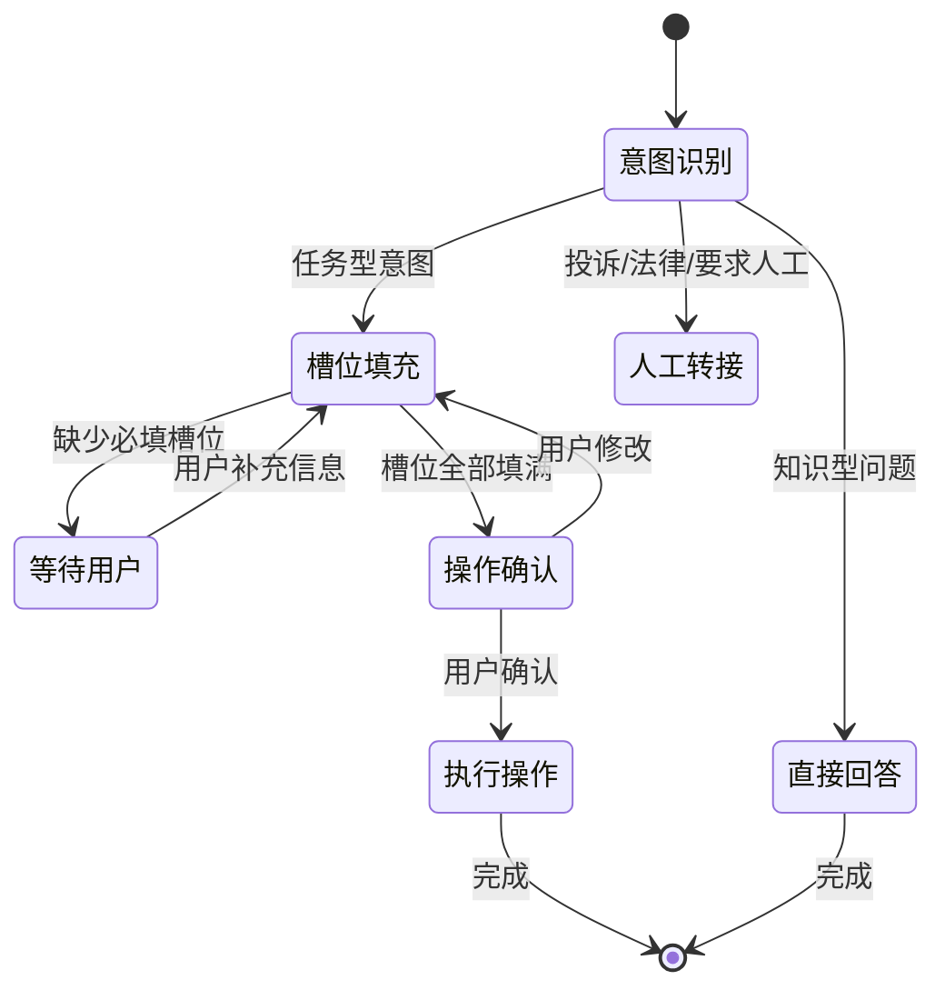

# 2.16 AI 对话设计模式

单轮问答好写——用户问，AI 答，完事。但大多数 AI 产品要处理的是**多轮对话**，而且用户说的话经常不完整、有歧义、会改变主意。这一节讲几个关键的对话设计模式，帮你把"能用"的对话 AI 做成"好用"的。

---

## 核心挑战：对话 AI 面临的四个难题

```
1. 信息不完整：用户说"帮我订票"，没说从哪到哪、什么时间
2. 表达有歧义：用户说"明天"，你不知道他是在问还是在确认
3. 用户改变主意：刚说订单程后来说"等等，改成双程"
4. 上下文积累：对话越来越长，哪些信息还有效，哪些被覆盖了
```

---

## 模式一：槽位填充（Slot Filling）

这是最实用的对话设计模式，适合"完成一个任务需要收集多项信息"的场景（订票、预约、下单等）。

**思路**：把任务需要的信息定义成"槽位"（Slot），通过多轮对话逐步填满它们，全部填满后执行操作。

```javascript
// 定义任务所需的槽位
const flightBookingSlots = {
  departure: { label: '出发城市', required: true, value: null },
  destination: { label: '目的城市', required: true, value: null },
  date: { label: '出发日期', required: true, value: null },
  passengers: { label: '乘客人数', required: false, value: 1, default: 1 },
}

// 提取当前消息里能填的槽位
async function extractSlots(userMessage, currentSlots) {
  const res = await client.chat.completions.create({
    model: MODEL,
    messages: [{
      role: 'system',
      content: `从用户消息里提取以下信息，只输出 JSON（没提到的字段用 null）：
${Object.entries(currentSlots).map(([k, v]) => `- ${k}：${v.label}`).join('\n')}`
    }, {
      role: 'user', content: userMessage
    }],
    response_format: { type: 'json_object' }
  })

  const extracted = JSON.parse(res.choices[0].message.content)

  // 合并：只更新非 null 的字段（不要用新消息覆盖已有值，除非明确改了）
  const updated = { ...currentSlots }
  for (const [key, val] of Object.entries(extracted)) {
    if (val !== null && val !== undefined) {
      updated[key] = { ...currentSlots[key], value: val }
    }
  }
  return updated
}

// 找出下一个要问的槽位
function nextMissingSlot(slots) {
  return Object.values(slots).find(s => s.required && s.value === null) ?? null
}

// 主对话循环
async function handleBookingTurn(userMessage, sessionSlots) {
  // 1. 从用户消息里提取槽位
  const slots = await extractSlots(userMessage, sessionSlots)

  // 2. 检查是否所有必填槽位都有值了
  const missing = nextMissingSlot(slots)

  if (missing) {
    // 3. 还有空槽位，引导用户填写
    return {
      reply: await generateQuestion(missing, slots),
      slots,
      done: false
    }
  } else {
    // 4. 所有槽位填满，确认并执行
    return {
      reply: await generateConfirmation(slots),
      slots,
      done: true
    }
  }
}

async function generateQuestion(missingSlot, currentSlots) {
  const filledSummary = Object.values(currentSlots)
    .filter(s => s.value !== null)
    .map(s => `${s.label}：${s.value}`)
    .join('，')

  const res = await client.chat.completions.create({
    model: MODEL,
    messages: [{
      role: 'user',
      content: `我在帮用户订机票。已知信息：${filledSummary || '暂无'}。
现在需要询问"${missingSlot.label}"，请用自然、友好的方式提问（一句话）。`
    }]
  })
  return res.choices[0].message.content
}
```

> 💡 **关键设计决策**：槽位更新时用**合并而非覆盖**——"日期"有值了，下一条消息没再提日期，就不要把日期清空。只有用户明确说"改一下，日期换成…"才覆盖。

---

## 模式二：澄清追问（Disambiguation）

用户说的话有歧义时，先追问确认，而不是猜。但追问有成本——每次追问都让用户多等一轮。

**原则：不是每次歧义都要问，只有影响操作正确性的歧义才值得问。**

```javascript
async function shouldAskClarification(userMessage, context) {
  const res = await client.chat.completions.create({
    model: MODEL,
    messages: [{
      role: 'system',
      content: `判断用户的请求是否有关键歧义，需要追问才能正确完成任务。
输出 JSON：{"needsClarification": true/false, "question": "追问的话（如果需要）", "reason": "原因"}`
    }, {
      role: 'user',
      content: `上下文：${context}\n用户说：${userMessage}`
    }],
    response_format: { type: 'json_object' }
  })

  return JSON.parse(res.choices[0].message.content)
}
```

**不同级别的歧义处理策略：**

```
高风险歧义（结果不可逆）→ 必须追问
  例："删除所有数据" → 追问"你是说删除当前项目的所有数据，还是账户下所有数据？"

中等歧义（结果可逆）→ 做出最可能的假设 + 说明假设 + 提供纠正入口
  例："发给他" → "好的，我将把这份报告发给张三（最近联系的人），发完了告诉我如果需要换人。"

低风险歧义（可以猜）→ 直接做，不问
  例："翻译一下" → 假设翻译成中英文对应的另一种，做了再说
```

---

## 模式三：实体追踪（Entity Tracking）

多轮对话里，用户经常用代词或简写指代前面提过的东西。你需要维护一个"上下文实体表"。

```javascript
// 维护对话里出现的实体
class EntityTracker {
  constructor() {
    this.entities = {}   // { 实体名: { type, value, mentionedAt } }
  }

  async update(userMessage, assistantMessage) {
    const res = await client.chat.completions.create({
      model: MODEL,
      messages: [{
        role: 'system',
        content: `从以下对话中提取或更新实体信息。
输出 JSON，key 是实体名（如 "当前文件"、"目标用户"），value 是 {type, value}。
已有实体：${JSON.stringify(this.entities)}`
      }, {
        role: 'user',
        content: `用户：${userMessage}\nAI：${assistantMessage}`
      }],
      response_format: { type: 'json_object' }
    })

    const newEntities = JSON.parse(res.choices[0].message.content)
    this.entities = { ...this.entities, ...newEntities }
  }

  // 把当前实体上下文注入到下一轮的 System Prompt
  toContext() {
    if (Object.keys(this.entities).length === 0) return ''
    return `\n当前对话上下文：\n${
      Object.entries(this.entities)
        .map(([k, v]) => `- ${k}：${v.value}`)
        .join('\n')
    }`
  }
}

// 使用
const tracker = new EntityTracker()
const systemPrompt = `你是一个文件管理助手。` + tracker.toContext()
```

---

## 模式四：确认 + 回滚

执行操作前给用户看一遍"我理解的是什么"，并提供改正机会；执行后提供撤销路径。

```javascript
// 操作前：生成确认摘要
async function generateConfirmSummary(intent, params) {
  return await llm([{
    role: 'user',
    content: `用一句话自然地总结即将执行的操作，供用户确认：
操作：${intent}
参数：${JSON.stringify(params)}
格式："{我将 xxx，}请确认。"`
  }])
}

// 操作后：提供撤销入口
function executeWithUndo(operation, undoFn) {
  return async () => {
    const result = await operation()
    return {
      result,
      undoMessage: '操作完成。如需撤销，请回复"撤销"。',
      undo: undoFn
    }
  }
}
```

---

## 模式五：优雅降级到人工

对话 AI 处理不了的时候，要有体面的退出方式，而不是在错误里打转。

```javascript
// 识别"需要转人工"的信号
const HANDOFF_TRIGGERS = [
  { pattern: /人工|真人|客服|投诉|负责人/i, reason: '用户主动要求人工' },
  { pattern: /\b(法律|律师|起诉|赔偿)\b/i, reason: '涉及法律纠纷' },
]

function shouldHandoff(message, failureCount) {
  // 用户主动要求
  for (const { pattern, reason } of HANDOFF_TRIGGERS) {
    if (pattern.test(message)) return { yes: true, reason }
  }
  // AI 连续失败（同一个问题答不上来）
  if (failureCount >= 2) return { yes: true, reason: 'AI 多次无法解决' }
  return { yes: false }
}

function generateHandoffMessage(reason) {
  const messages = {
    '用户主动要求人工': '好的，我来帮你转接人工客服，预计等待时间 2-3 分钟。',
    '涉及法律纠纷': '这类问题需要专业人员处理，我来为你安排一位客服专员。',
    'AI 多次无法解决': '这个问题我没能帮到你，让我帮你转接专业的客服同事。',
  }
  return messages[reason] ?? '我来帮你转接人工客服。'
}
```

---

## 对话状态机设计

把对话流程画成状态机，有利于测试和维护：



```javascript
// 用状态机驱动对话
class ConversationStateMachine {
  constructor() {
    this.state = 'intent_recognition'
    this.slots = {}
    this.failureCount = 0
  }

  async handleTurn(userMessage) {
    switch (this.state) {
      case 'intent_recognition': return this.recognizeIntent(userMessage)
      case 'slot_filling': return this.fillSlots(userMessage)
      case 'confirmation': return this.handleConfirmation(userMessage)
      default: return this.handleFallback(userMessage)
    }
  }

  async recognizeIntent(msg) {
    // ... 识别意图，切换状态
  }
}
```

---

## 🛠️ 实战练习：实现一个槽位填充对话

实现一个"查快递"对话 Agent，需要收集：单号（必填）、手机号后 4 位（可选，用于验证）：

1. 定义槽位结构
2. 实现槽位提取（`extractSlots`）
3. 测试三种输入场景：a) 第一条消息就给了单号；b) 先说"帮我查快递"再说单号；c) 给了格式错误的单号

**期望结果**：对话能自然地引导用户补充缺失信息，单号填上后就执行查询（模拟），不会重复问已经回答过的问题。

**进阶挑战**：加"用户中途改单号"的测试用例，验证槽位合并逻辑是否正确处理覆盖更新。

---

## 📌 关键结论

1. 槽位填充是任务型对话的核心模式：定义必要信息 → 逐步收集 → 填满执行
2. 歧义不是每次都要问：影响结果正确性的问，低风险的直接猜 + 说明假设
3. 实体追踪让 AI 理解"它/他/这个"指什么，避免对话重置上下文
4. 高风险操作要先确认摘要，操作后提供撤销路径
5. 转人工是对话 AI 的重要功能，不是失败，要设计得体面

---

下一节：[2.17 AI 系统成本的全局视角](./cost-estimation)
