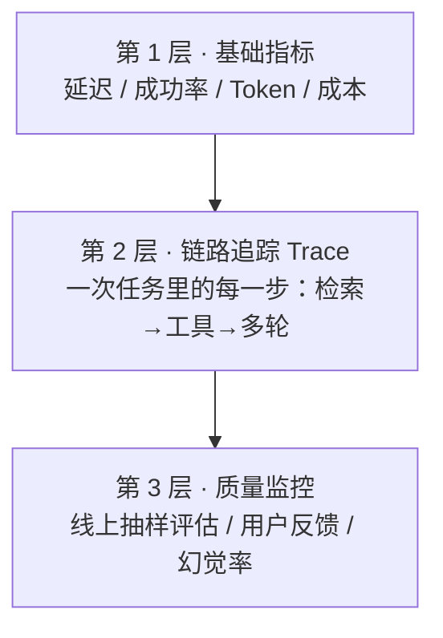

# 2.9 可观测性与线上监控

[2.5 评估](./evaluation) 解决的是"上线前怎么知道它好不好"，这一节解决"**上线后怎么知道它还好不好**"。传统服务你盯 CPU、错误率、延迟就够了；AI 服务多一层麻烦——输入输出都是自然语言、结果还不确定，光看 HTTP 200 完全看不出它有没有在胡说。

> 💡 **类比**：传统监控像看体温计——数字超标就报警。AI 监控像给一个新来的客服装监控摄像头——你不只要知道"他有没有迟到"（延迟/成功率），还要能回放"他到底跟客户说了什么"（每次请求的输入输出），以及"他最近回答质量是不是下滑了"（线上质量评估）。

## 三个层次，从浅到深



大多数团队只做了第 1 层就以为做完了——其实出问题最多、最难查的恰恰是第 2、3 层。

---

## 第 1 层：基础指标

每次模型调用都该记下来：**耗时、是否成功、用了哪个模型、输入/输出 Token、折算成本**。`response.usage` 里就有 Token 数，别浪费。

```javascript
// 一个极简的"调用包装器"：把每次 LLM 调用的关键信息记下来
async function tracedCall(client, params, meta = {}) {
  const start = Date.now()
  try {
    const res = await client.chat.completions.create(params)
    logMetric({
      ...meta,
      model: params.model,
      ok: true,
      latencyMs: Date.now() - start,
      promptTokens: res.usage.prompt_tokens,
      completionTokens: res.usage.completion_tokens,
    })
    return res
  } catch (err) {
    logMetric({ ...meta, model: params.model, ok: false, latencyMs: Date.now() - start, error: String(err) })
    throw err
  }
}
```

> ⚠️ 平均延迟会骗人。一定要看 **P95 / P99**（最慢的那 5% / 1%）——AI 请求长尾很重，平均 2 秒可能 P99 已经 15 秒，用户体感差的就是那部分。

---

## 第 2 层：链路追踪（Trace）

一次用户请求，背后往往不是一次模型调用，而是**一串**：RAG 检索 → 拼 Prompt → 模型生成 → 可能再调工具 → 再生成。出问题时你要能回放整条链：是检索没召回？还是 Prompt 拼错？还是模型本身答歪？

办法是给一次完整任务分配一个 `traceId`，把这条链上的每一步都挂在同一个 id 下，形成一棵"调用树"。

```javascript
import { randomUUID } from "crypto"

async function handleQuery(question) {
  const traceId = randomUUID()
  const t = (step, data) => logSpan({ traceId, step, ts: Date.now(), ...data })

  const docs = await retrieve(question)
  t("retrieve", { query: question, hitCount: docs.length, topScore: docs[0]?.score })

  const prompt = buildPrompt(question, docs)
  const res = await tracedCall(client, { model: MODEL, messages: prompt }, { traceId })
  t("generate", { outputLen: res.choices[0].message.content.length })

  return res
}
```

**不想自己造轮子**：[Langfuse](https://langfuse.com)（开源、可自托管，数据不出内网）是国内团队常用的选择，几行 SDK 就能把 trace、token、成本、线上评估都接上；LangSmith 类似但是闭源 SaaS。先用结构化日志手搓也完全够起步。

---

## 第 3 层：质量监控（最容易被忽略）

服务没报错 ≠ 回答是对的。AI 质量会**悄悄退化**：你改了个 Prompt、厂商偷偷更新了模型、用户问法变了——指标全绿，但答案越来越差。靠人工抽查根本不可持续，要做自动化质量监控：

- **线上抽样评估**：每天从真实流量里抽一批，用 [LLM-as-judge](./evaluation)（让一个模型按标准给答案打分）跑一遍，盯住分数趋势线
- **采集用户反馈**：👍/👎 按钮、"重新生成"次数、人工转接率，都是质量信号
- **盯关键指标**：幻觉率（答案有没有依据）、拒答率、RAG 的"召回了但没用上"比例

> ⚠️ 模型回答质量下滑往往**没有任何报错**。如果你只监控错误率和延迟，等用户投诉了你才发现，就已经晚了。质量趋势线和成本曲线一样重要。

---

## 告警：别等用户投诉

至少配三类告警：**成本突增**（比如日消耗超过阈值，常是死循环或被刷）、**错误率/超时率上升**、**质量分数跌破基线**。前两类是传统监控的延伸，第三类是 AI 服务独有的，也最该重视。

---

## 🛠️ 实战练习：给调用加一层可观测包装

给你现有的任意 LLM 调用套一层日志，把每次调用写成一行 JSON（JSONL），跑一批请求后做统计。

```javascript
import { appendFileSync, readFileSync } from "fs"
import OpenAI from "openai"

const client = new OpenAI({
  baseURL: "https://api.deepseek.com",
  apiKey: process.env.DEEPSEEK_API_KEY,
})

const PRICE = { in: 0.001, out: 0.002 }   // 每千 Token 价格，按你实际模型填

async function tracedCall(messages, meta = {}) {
  const start = Date.now()
  const res = await client.chat.completions.create({ model: "deepseek-v4-flash", messages })
  const u = res.usage
  const cost = (u.prompt_tokens * PRICE.in + u.completion_tokens * PRICE.out) / 1000
  appendFileSync("./llm-metrics.jsonl", JSON.stringify({
    ts: Date.now(), ...meta,
    latencyMs: Date.now() - start,
    promptTokens: u.prompt_tokens, completionTokens: u.completion_tokens,
    costYuan: Number(cost.toFixed(5)),
  }) + "\n")
  return res.choices[0].message.content
}

// 跑几条
for (const q of ["你好", "解释一下什么是向量数据库", "用一句话总结 RAG"]) {
  await tracedCall([{ role: "user", content: q }], { feature: "demo" })
}

// 简单统计
const rows = readFileSync("./llm-metrics.jsonl", "utf8").trim().split("\n").map(JSON.parse)
const sum = (k) => rows.reduce((a, r) => a + r[k], 0)
rows.sort((a, b) => a.latencyMs - b.latencyMs)
console.log("请求数:", rows.length)
console.log("P95 延迟(ms):", rows[Math.floor(rows.length * 0.95) - 1]?.latencyMs)
console.log("总成本(元):", sum("costYuan").toFixed(5))
console.log("总 Token:", sum("promptTokens") + sum("completionTokens"))
```

**期望结果**：得到一个 `llm-metrics.jsonl`，以及这批请求的 P95 延迟、总成本、总 Token。

**进阶挑战**：给 `tracedCall` 加一个 `traceId` 参数，把"检索 + 生成"两步写进同一个 trace，再写个脚本按 traceId 把一次任务的多步还原出来。

---

## 📌 关键结论

1. AI 可观测性分三层：基础指标 → 链路追踪 Trace → 质量监控，多数团队只做了第一层
2. 每次调用都记 `response.usage`（Token/成本）和耗时；延迟要看 **P95/P99**，平均值会骗人
3. 一次任务常是多步调用，用 `traceId` 串成调用树，出问题才能定位是检索、拼 Prompt 还是生成的锅
4. 质量会**无报错地悄悄退化**——必须做线上抽样评估 + 用户反馈，把质量趋势当成核心指标
5. 自托管首选 Langfuse（数据不出内网）；告警至少覆盖成本突增、错误率、质量跌破基线

---

下一节：[2.10 AI 功能安全上线](./safe-launch)
