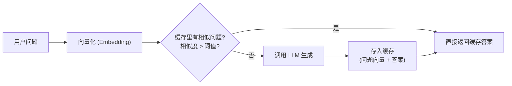

# 2.13 语义缓存

普通缓存（如 Redis）是精确匹配的：只有两次请求完全一样才能命中缓存。但 AI 场景里，用户每次问的话略有不同，"怎么退款" 和 "退款流程是什么" 本质是一个问题，精确缓存完全失效。

**语义缓存（Semantic Cache）**：把问题先向量化，缓存时存的不是原始字符串而是向量，查询时也向量化后做相似度搜索，相似度超过阈值就直接返回缓存——语义一样、表述不同，也能命中。

---

## 什么时候值得做语义缓存

不是所有 AI 场景都适合：

| 适合 | 不适合 |
|-----|-------|
| 内容支持/FAQ 类问答（用户问的问题高度重复） | 创意生成（每次都要不一样） |
| 搜索增强问答（问题集中在几个主题） | 个性化分析（结果因人而异） |
| 文档/知识库问答（查阅类，不需要实时最新） | 需要最新信息（市价、新闻） |
| 高频低变化场景（客服 bot、工具文档助手） | 多轮对话（每轮上下文都不同） |

> 💡 典型收益：一个客服 bot 的问题，可能 60-70% 都是几十个高频变体——做了语义缓存后，这些问题的响应时间从 2-3 秒降到 50ms 以内，成本也同步下降。

---

## 原理图



---

## 最小实现（Node.js）

```javascript
import { createClient } from "@redis/client"   // 或换成任意 KV / 向量库

const redis = createClient()
await redis.connect()

// 简单内存版（生产换成 Redis + 向量索引，如 pgvector / Qdrant）
const cache = []   // [{ embedding: float[], answer: string, question: string }]

// ── 工具函数 ──────────────────────────────────────────
function cosineSim(a, b) {
  const dot = a.reduce((s, v, i) => s + v * b[i], 0)
  const magA = Math.sqrt(a.reduce((s, v) => s + v * v, 0))
  const magB = Math.sqrt(b.reduce((s, v) => s + v * v, 0))
  return dot / (magA * magB)
}

async function embed(text) {
  const res = await client.embeddings.create({
    model: "text-embedding-3-small",   // 或 bge-m3 / qwen-embedding
    input: text
  })
  return res.data[0].embedding
}

// ── 核心逻辑 ──────────────────────────────────────────
async function cachedAsk(question, threshold = 0.92) {
  const qEmbedding = await embed(question)

  // 1. 在缓存里找最相似的问题
  let best = null
  for (const entry of cache) {
    const sim = cosineSim(qEmbedding, entry.embedding)
    if (sim > threshold && (!best || sim > best.sim)) {
      best = { ...entry, sim }
    }
  }

  if (best) {
    console.log(`缓存命中 (相似度 ${best.sim.toFixed(3)})：${best.question}`)
    return best.answer
  }

  // 2. 未命中，调用 LLM
  const res = await client.chat.completions.create({
    model: MODEL,
    messages: [{ role: "user", content: question }]
  })
  const answer = res.choices[0].message.content

  // 3. 存入缓存
  cache.push({ embedding: qEmbedding, answer, question })
  return answer
}

// 测试
await cachedAsk("怎么退款？")          // 第一次：调 LLM
await cachedAsk("退款流程是什么")      // 命中（相似度 ~0.95）
await cachedAsk("我要申请退款")        // 命中（相似度 ~0.94）
await cachedAsk("今天天气怎么样")      // 未命中，调 LLM
```

---

## 阈值怎么选

这是语义缓存最需要调的参数。**阈值太低会返回错误答案，太高跟精确匹配没区别。**

```
阈值 0.85：很激进，"退款" 和 "换货" 可能都命中，容易答错
阈值 0.92：适中，表述不同但意思相同的问题能命中（推荐起点）
阈值 0.97：很保守，需要几乎一样的问题才命中，收益少
```

**调校方法：**
1. 收集 100-200 个真实用户问题
2. 对每对问题计算相似度，人工标注"这两个是不是同一个问题"
3. 找到最大化 F1（精准 + 召回）的阈值

> ⚠️ 阈值不是越高越安全。如果阈值太高，缓存命中率接近零，你白写了这个逻辑。先从 0.92 开始，根据实际数据往上或往下调。

---

## 生产级方案：用向量数据库

内存版不适合生产（重启丢数据、无法水平扩展）。生产里把缓存存到向量数据库里：

```javascript
// 以 Qdrant 为例（pgvector、Milvus、Pinecone 思路一样）
import { QdrantClient } from "@qdrant/js-client-rest"

const qdrant = new QdrantClient({ url: "http://localhost:6333" })

// 创建集合（一次性）
await qdrant.createCollection("semantic_cache", {
  vectors: { size: 1536, distance: "Cosine" }
})

async function cachedAskProd(question, threshold = 0.92) {
  const qEmbedding = await embed(question)

  // 搜索相似问题
  const results = await qdrant.search("semantic_cache", {
    vector: qEmbedding,
    limit: 1,
    score_threshold: threshold,
    with_payload: true
  })

  if (results.length > 0) {
    return results[0].payload.answer
  }

  // 未命中：调 LLM + 写入缓存
  const answer = await callLLM(question)
  await qdrant.upsert("semantic_cache", {
    points: [{
      id: Date.now(),
      vector: qEmbedding,
      payload: { question, answer, created_at: new Date().toISOString() }
    }]
  })
  return answer
}
```

---

## 缓存失效策略

**语义缓存最难的问题是失效**——答案过时了怎么办？

| 策略 | 适合场景 |
|-----|---------|
| **TTL（时间过期）** | 有时效性的内容，设过期时间（如 7 天）|
| **版本标签** | 内容更新时，标记为新版本，旧版本缓存自动失效 |
| **手动清除** | 知识库更新时，批量删除相关缓存 |
| **永不失效** | 不变的事实性知识（历史、定义类） |

```javascript
// 带 TTL 的查询（Qdrant 不支持原生 TTL，用 payload 里的时间戳过滤）
const results = await qdrant.search("semantic_cache", {
  vector: qEmbedding,
  limit: 1,
  score_threshold: 0.92,
  filter: {
    must: [{
      key: "created_at",
      range: { gte: new Date(Date.now() - 7 * 24 * 3600 * 1000).toISOString() }
    }]
  },
  with_payload: true
})
```

---

## 语义缓存 vs Prompt Caching

别混淆这两个概念：

| | 语义缓存（Semantic Cache） | Prompt Caching（KV Cache） |
|--|------------------------|--------------------------|
| 作用层 | **你的应用层** | **模型 API 层** |
| 缓存什么 | 问题→答案（完整响应） | 长 Prompt 的 KV 计算结果 |
| 触发条件 | 相似问题（语义匹配） | 相同的 Prompt 前缀 |
| 效果 | 完全跳过 LLM 调用 | 仍调 LLM，但减少输入 Token 计算 |
| 实现者 | 你自己写 | 厂商自动（或手动标记） |

两者可以叠加用：**语义缓存**负责跳过整个 LLM 调用，**Prompt Caching** 负责在没命中语义缓存时，让 LLM 调用本身更便宜。

---

## 🛠️ 实战练习：给 FAQ Bot 加语义缓存

用上面的内存版代码，给你的一个问答功能加语义缓存：

1. 收集或编写 20 条真实问题（包含 5-10 组语义相同、表述不同的变体）
2. 接入上面的 `cachedAsk` 函数，跑全部 20 条问题
3. 打印每条的命中/未命中，以及实际的相似度得分
4. 统计"缓存命中后省了多少次 LLM 调用"

**期望结果**：你直观看到语义缓存命中的效果，并能解释为什么某对问题命中了、某对没有。

**进阶挑战**：把阈值从 0.92 改成 0.85 再改成 0.97，观察误命中和漏命中的变化，找出适合你数据集的最优阈值。

---

## 📌 关键结论

1. 语义缓存用向量相似度代替精确匹配，让表述不同但意思相同的问题命中缓存
2. 阈值从 0.92 开始调，太低答案会张冠李戴，太高命中率接近零
3. 生产里用向量数据库持久化，搭配 TTL 或版本标签做失效管理
4. 和 Prompt Caching 是不同层的优化：语义缓存省掉整个 LLM 调用，Prompt Caching 让单次调用更便宜
5. 适合高频重复的知识类问答，不适合创意生成、个性化分析等结果需要每次不同的场景

---

下一节：[第 3 章 · 理解引擎盖下面](/ch3-under-the-hood/)
