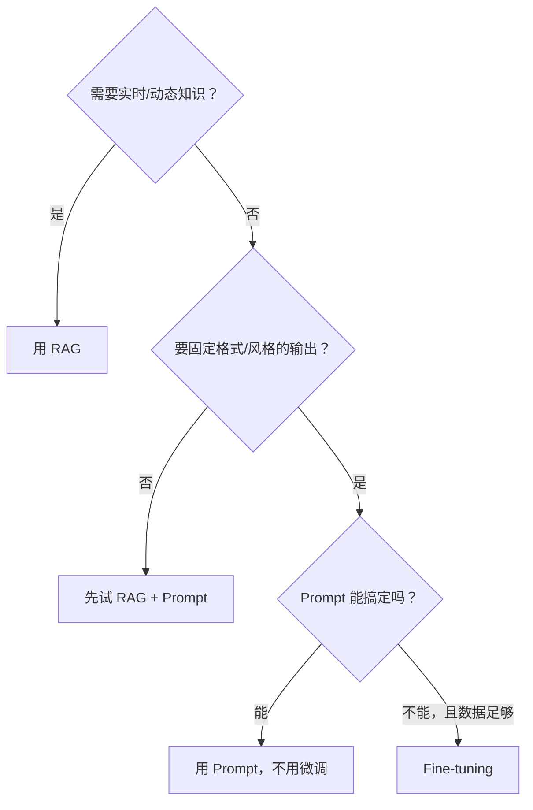

# 3.4 Fine-tuning vs RAG

这是最常见的选择题之一。什么时候用 RAG，什么时候用 Fine-tuning？

## Fine-tuning 是什么

Fine-tuning（微调）是在预训练好的模型基础上，用你自己的数据继续训练，让模型学会你特定领域的知识或风格。

> 💡 **类比**：预训练模型是一个博学的通才。Fine-tuning 是送这个通才去参加专业培训班，让他成为某个领域的专家。

**Fine-tuning 会改变什么：**
- 模型的"说话方式"和风格
- 对特定领域术语的理解
- 按特定格式输出的能力
- 做特定任务（分类、提取）的准确率

**Fine-tuning 不会改变什么：**
- 模型的基础推理能力（上限由基础模型决定）
- 模型的参数量（模型大小不变）
- 训练数据截止日期之后的知识

---

## 两者的本质区别

| 维度 | RAG | Fine-tuning |
|-----|-----|-------------|
| 知识来源 | 查询外部文档 | 烧录进模型权重 |
| 知识更新 | 随时更新文档即可 | 需要重新训练 |
| 成本 | 存储 + 检索费用 | 训练费用（可能很贵）+ 存储 |
| 适合 | 事实性知识、文档问答 | 风格、格式、固定任务 |
| 可解释性 | 能看到参考了哪些文档 | 模型内部，难以解释 |

---

## 什么时候用 RAG

✅ 你需要 AI 回答关于**你的业务文档、产品知识库**的问题  
✅ 信息**经常更新**（如价格、政策、产品信息）  
✅ 需要**引用来源**（"根据第 3 条规定..."）  
✅ 文档量大，无法全部放进上下文  

```
典型场景：
- 企业内部知识库问答
- 客服机器人（回答产品问题）
- 文档检索助手
```

---

## 什么时候用 Fine-tuning

✅ 你需要 AI **以特定的风格或格式**输出（比如你们公司的写作风格）  
✅ 你有一个**固定的、重复性的任务**，想让 AI 更专注于这个任务  
✅ 需要**减少 Prompt 长度**（把例子"烧进"模型，不用每次都放 few-shot）  
✅ 特定领域的**分类、提取、打标签**任务  

```
典型场景：
- 训练模型用特定的语气回复用户
- 从合同里提取特定字段（结构化抽取）
- 代码风格统一（总是生成符合你们团队规范的代码）
```

---

## ⚠️ Fine-tuning 不适合的场景

❌ **不要用 Fine-tuning 来"注入知识"**  
"让模型记住我们所有的产品信息"——这是 RAG 的活，Fine-tuning 做这个效果差、成本高。

❌ **不要用 Fine-tuning 解决 Prompt 问题**  
如果 Prompt 写清楚就能解决，不需要 Fine-tuning。Fine-tuning 成本更高，先把 Prompt 工程做到位。

❌ **数据量太少**  
Fine-tuning 需要足够的高质量训练数据，通常几百到几千个样本起步。

---

## LoRA 和 QLoRA 是什么

这是 Fine-tuning 的两种高效方法，你可能会看到这些词。

**传统 Fine-tuning** 需要更新模型的所有参数，非常耗资源。

**LoRA（Low-Rank Adaptation）**：只训练模型里的一小部分参数（加了两个小矩阵），但效果接近全量训练。大幅降低训练成本。

**QLoRA**：在 LoRA 基础上，对模型做量化（用更少的比特存储），进一步降低显存需求。4 张消费级 GPU 也能 Fine-tune 70B 的模型。

**你需要了解的程度**：知道这些词是"更省钱的 Fine-tuning 方式"就够了，不需要自己实现。

---

## 实际决策流程



---

---

## 🛠️ 实战练习：场景判断

下面 4 个场景，判断该用 Prompt Engineering、RAG 还是 Fine-tuning：

**场景 A**：你想让 AI 回答关于你们公司产品的问题，产品文档有 200 页，每个月更新一次。

**场景 B**：你想让 AI 生成代码时，总是使用你们团队定义的特定函数命名规范（下划线命名、特定前缀等），不管用户怎么描述需求。

**场景 C**：你想让 AI 在对话中能查询用户的历史订单，回答"我上次买的是什么"这类问题。

**场景 D**：你想让 AI 把用户上传的合同自动分类成"劳动合同/服务合同/购销合同"，要求准确率很高，有 5000 份标注好的历史合同。

<details>
<summary>参考答案（先自己想，再看）</summary>

- **场景 A** → RAG（知识是动态更新的，文档量大）
- **场景 B** → Fine-tuning（固定的风格/格式要求，用 Few-shot Prompt 效果不稳定）
- **场景 C** → Tool Use + RAG（需要实时查询用户数据，不是静态知识库）
- **场景 D** → Fine-tuning（固定任务、有大量标注数据、对准确率要求高）

</details>

---

## 📌 关键结论

1. RAG 是外挂知识库，Fine-tuning 是改变模型本身
2. 业务知识、动态内容用 RAG；风格、格式、固定任务用 Fine-tuning
3. 先做好 Prompt Engineering，再考虑 Fine-tuning
4. LoRA/QLoRA 让 Fine-tuning 更实惠，但仍然有成本

---

下一节：[3.5 怎么读 AI 论文](./read-papers)
