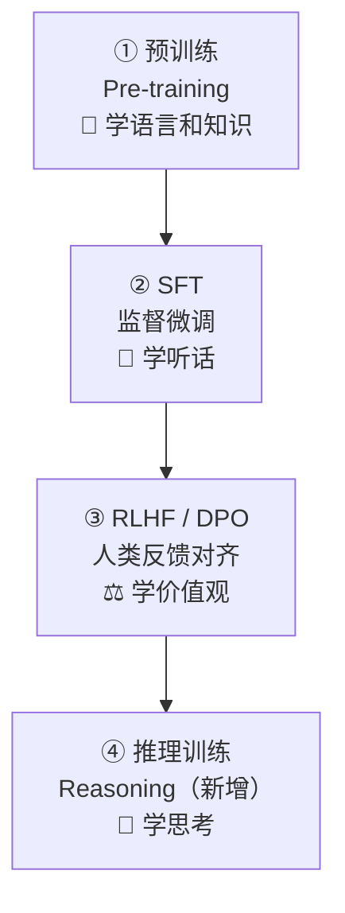

# 3.3 模型是怎么训练出来的

你不需要自己训练模型，但了解训练过程，能帮助你理解模型的能力边界和行为来源。

## 三个阶段

现代 LLM 的训练通常分三个阶段（近两年又多了一个"推理训练"）：



> 每一阶段都在前一阶段的成果上继续训练：先会说话 → 再听懂指令 → 再对齐价值观 → 最后学会"想清楚再答"。

---

### 阶段一：Pre-training（预训练）

**在做什么：** 用海量文本数据训练模型，让它学会"预测下一个词"。

**数据规模：** 互联网上的文字、书籍、代码，几万亿个 Token。

**训练时间：** 几个月，消耗数千块 GPU。

**训练完的模型叫：** Base Model（基础模型）

> 💡 **类比**：就像一个人从出生到成年，读了所有能读到的书、文章、对话，形成了对语言和世界的基础理解。

这个阶段结束后，模型已经有了强大的语言能力，但还不"听话"——给它一个问题，它可能会继续补全这个问题，而不是回答它。

---

### 阶段二：SFT（Supervised Fine-Tuning，监督微调）

**在做什么：** 用"问题-好回答"的配对数据，教模型怎么有帮助地响应指令。

**数据形式：**
```
[用户]: 帮我解释什么是光合作用
[助手]: 光合作用是植物利用阳光...（人工写的好回答）
```

**训练完的模型叫：** Instruct Model（指令模型）

经过 SFT 后，模型开始能够按照指令回答问题，但回答质量还不够稳定，有时会产生有害内容。

---

### 阶段三：RLHF（Reinforcement Learning from Human Feedback，人类反馈强化学习）

**在做什么：** 让模型的回答更符合人类偏好——更有帮助、更安全、更诚实。

**流程：**

```
1. 让模型对同一个问题生成多个不同回答
2. 人工标注者排列这些回答（哪个更好）
3. 训练一个"评分模型"，学习什么是好回答
4. 用评分模型指导 LLM 的训练，让它产生更高分的回答
```

这就是为什么 Claude 和 ChatGPT 不是"纯粹的预测机器"，而是"有价值观的助手"——那些价值观来自于 RLHF 阶段人类标注者的偏好。

**DPO（Direct Preference Optimization）** 是 RLHF 的一种替代方法，更简单、稳定，现在很多模型在用。

---

## 新阶段：推理训练（Reasoning）

2025 年起多了一类训练，专门教模型"先想清楚再回答"，产出的就是 [1.7 节](/ch1-llm-engineering/reasoning-models) 讲的**推理模型**。

和 RLHF"对齐人类偏好"不同，推理训练的奖励信号往往很简单粗暴：**最终答案对不对**（数学题答案、代码能不能跑通）。

```
让模型对一道题反复生成不同的"思考过程 + 答案"
        ↓
只看最终答案对不对来打分（对了奖励，错了惩罚）
        ↓
模型自己摸索出"先拆解、再尝试、自我验证、纠错"的习惯
```

DeepSeek-R1 用的 **GRPO** 就是这类强化学习方法。神奇之处在于：没人教模型"该怎么想"，它在"只奖励正确答案"的压力下，**自己长出了推理能力**。

这也解释了 [1.7 节](/ch1-llm-engineering/reasoning-models) 的现象——推理模型靠"在回答时多花算力思考"（test-time compute）换准确率，所以又慢又贵，但难题更强。

---

## 为什么 AI 会有"性格"

你有没有注意到：Claude 喜欢说"当然！"，GPT 会说"当然，我很乐意帮助..."，不同模型有不同的说话风格？

这些来自 SFT 阶段的训练数据风格，以及 RLHF 阶段标注者的偏好。

Anthropic 用了一种叫 **Constitutional AI（宪法式 AI）** 的方法来训练 Claude——顾名思义，就像给 AI 制定一部"宪法"：先写下一系列原则（诚实、有帮助、无害等），再用这些原则让 AI 自己评判自己的回答好不好，而不完全依赖人工标注。

这就是为什么 Claude 和 GPT 感觉"性格不一样"：两者的 RLHF 数据和价值取向不同，GPT 更倾向于取悦用户，Claude 更倾向于诚实和直接。

---

## 参数量和能力的关系

| 参数规模 | 代表 | 特点 |
|---------|-----|-----|
| 1B - 7B | Llama 3.1 8B, Phi-3 | 轻量，可本地运行，基础任务够用 |
| 13B - 70B | Llama 3.1 70B | 较强，能处理复杂任务 |
| 100B+ | GPT-4, Claude 3 Opus | 最强，但需要大量 GPU |

更多参数 ≠ 一定更好，但在同等架构和数据质量下，更多参数通常意味着更强的能力。

**Quantization（量化）** 是用更少的比特来存储参数（比如从 32 位浮点数压缩到 4 位），让大模型能在消费级硬件上运行，代价是精度略有损失。

---

## MoE（Mixture of Experts，混合专家）

传统模型每次处理输入都激活全部参数。MoE 的思路是：有很多个"专家"子网络，每次只激活其中几个最相关的。

```
模型总参数：1000B
每次实际激活：约 50B（激活其中 5% 的专家）

效果：用 50B 的计算量，获得 1000B 模型的能力
```

GPT-4 和 Mixtral 据说使用了 MoE 架构。这就是为什么有些模型"声称参数很大但速度不慢"。

---

## 📌 关键结论

1. 训练分三阶段：预训练（学语言） → SFT（学听话） → RLHF（学价值观）
2. AI 的"性格"和"价值观"来自 SFT 数据和 RLHF 标注者偏好
3. 更多参数通常意味着更强能力，但不是绝对的
4. MoE 让大模型能以较低计算量运行

---

下一节：[3.4 Fine-tuning vs RAG](./finetuning-vs-rag)
