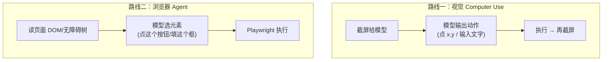

# 4.11 Computer Use 与浏览器 Agent

到目前为止，Agent 干活靠的是 [Tool Use](/ch1-llm-engineering/tool-use) 和 [MCP](/ch4-agent-mcp/)——本质都是调 API。但现实里**大量软件没有 API**：老旧的内部系统、只有网页的后台、桌面应用。Computer Use 就是让 Agent 像人一样**看屏幕、点鼠标、敲键盘**，去操作这些没有 API 的东西。

> 💡 **类比**：Tool Use 是 Agent 有了"会打电话的嘴"——能调用对方开放的接口。Computer Use 是给它装上"眼睛和手"——没有接口也没关系，它能像新员工一样看着屏幕自己操作。能力上限一下子从"有 API 的世界"扩展到"人能用鼠标干的一切"。

## 两条技术路线



**路线一：视觉 Computer Use** — 给模型一张屏幕截图，它直接输出"点击坐标 (834, 210)""输入这段文字"，执行后再截一张图，循环。优点是**通用**——任何能在屏幕上看到的东西它都能操作（桌面软件、画图、游戏）。缺点是慢、贵、点歪了就错。需要支持该能力的视觉模型（如 Anthropic 的 Computer Use）。

**路线二：浏览器 Agent** — 专做网页。不靠截图猜坐标，而是把页面的 **DOM / 无障碍树（accessibility tree）** 喂给模型，让它选"点这个按钮""在这个输入框填值"，再用 [Playwright](https://playwright.dev) / Puppeteer 精确执行。比视觉路线**更稳、更快、更便宜**，是网页类任务的首选。

> ⚠️ 别一上来就用视觉 Computer Use。**只要任务在浏览器里，优先走浏览器 Agent 路线**——基于 DOM 操作比基于截图猜坐标可靠一个量级。视觉路线留给"实在没有 DOM 可用"的桌面软件。

---

## 浏览器 Agent 的最小骨架

思路：Playwright 负责"手脚"（开页面、点击、抓内容），LLM 负责"大脑"（看到页面内容后决定下一步）。

```javascript
import { chromium } from "playwright"
import OpenAI from "openai"

const client = new OpenAI({ baseURL: "https://api.deepseek.com", apiKey: process.env.DEEPSEEK_API_KEY })

const browser = await chromium.launch()
const page = await browser.newPage()
await page.goto("https://example.com")

// 把页面可见文本抓出来给模型当"眼睛"（真实项目里更常用无障碍树，信息更结构化）
const visibleText = await page.evaluate(() => document.body.innerText.slice(0, 3000))

const res = await client.chat.completions.create({
  model: "deepseek-v4-flash",
  messages: [
    { role: "system", content: "你在操作浏览器。根据页面内容，决定下一步动作。只输出 JSON：{action, target, value}" },
    { role: "user", content: `任务：找到页面标题。\n\n页面内容：\n${visibleText}` },
  ],
})
console.log("模型决定的动作：", res.choices[0].message.content)
// 真实 Agent：解析这个动作 → 用 page.click()/page.fill() 执行 → 再抓页面 → 循环，直到任务完成

await browser.close()
```

> 现成框架：浏览器 Agent 这个方向已有 `browser-use`、Playwright MCP 等开源项目，把"抓页面 → 模型决策 → 执行"的循环封装好了，生产里通常基于它们二次开发，而不是从零搭。

---

## 工程现实：慢、贵、易错、有风险

Computer Use 很惊艳，但落地前你得清楚它的代价：

- **慢**：每一步都要"截图/读页面 → 模型推理 → 执行"，一个多步任务几十秒起步，没法做实时交互
- **贵**：截图是大图、token 消耗高；多步累积，成本远超普通文本 Agent
- **易错**：页面布局一变、弹窗一挡，就可能点错。要做重试、超时、断言"点完真的到了预期页面"
- **⚠️ 安全是头等大事**：一个会自己点鼠标的 Agent，理论上能删文件、发邮件、下单付款。必须**跑在隔离沙箱/容器里**、限制权限、对**不可逆的关键动作（付款、删除、发送）强制人类确认**，绝不要让它直接在你的主力机器上裸跑。

**什么时候才值得用**：有明确 ROI 的、**无 API 的、重复性 GUI 操作**——比如批量在某个只有网页的老后台里录入数据、定时从没有接口的系统里抓报表。如果对方有 API 或 MCP，永远优先用那个。

> 关于模型：稳定的视觉 Computer Use 目前主要靠 Anthropic 等头部闭源模型。国产模型和本地 Ollama 在"截图点坐标"这种精细视觉操作上还较弱；但**浏览器 Agent 路线**因为主要拼文本理解和决策，用国产模型（如 Qwen）也能跑通不少任务。

---

## 🛠️ 实战练习：浏览器"读取信息"小 Agent

从一个网页里提取结构化信息——先不做"点击操作"（风险大），只做"看"，体会浏览器 Agent 的感知-决策闭环。

```javascript
// 需要先安装：pnpm add playwright openai && npx playwright install chromium
import { chromium } from "playwright"
import OpenAI from "openai"

const client = new OpenAI({ baseURL: "https://api.deepseek.com", apiKey: process.env.DEEPSEEK_API_KEY })

const browser = await chromium.launch()
const page = await browser.newPage()
await page.goto("https://news.ycombinator.com")   // 换成任意你想抓的页面

const text = await page.evaluate(() => document.body.innerText.slice(0, 4000))
await browser.close()

const res = await client.chat.completions.create({
  model: "deepseek-v4-flash", temperature: 0,
  messages: [
    { role: "system", content: "从页面文本里提取前 5 条标题，输出 JSON 数组。只输出 JSON。" },
    { role: "user", content: text },
  ],
})
console.log(res.choices[0].message.content)
```

**期望结果**：模型从真实网页文本里提取出结构化的标题列表。你会直观感受到：① 页面文本喂给模型就能"看懂"；② 抓多少文本、怎么截断直接影响效果和成本。

**进阶挑战**：把它升级成一个真有"动作"的循环——让模型决定"点进第一条链接"，用 `page.click()` 执行，再抓新页面内容。**务必在动作执行前打印出来让自己确认**，体会为什么关键动作要加人类确认。

---

## 📌 关键结论

1. Computer Use 让 Agent 像人一样看屏幕、点鼠标键盘，把能力从"有 API 的世界"扩展到"人能用 GUI 干的一切"
2. 两条路线：视觉 Computer Use（截图→点坐标，通用但慢/贵/易错）、浏览器 Agent（基于 DOM/无障碍树，更稳更快）
3. **只要在浏览器里就优先走浏览器 Agent**（Playwright + LLM 决策），视觉路线留给没有 DOM 的桌面软件
4. 安全是头等大事：跑在沙箱里、限权限、对付款/删除/发送等不可逆动作强制人类确认
5. 慢、贵、易错——只在"无 API 的重复 GUI 操作"且有明确 ROI 时用；对方有 API/MCP 就永远优先用那个

---

第 4 章完成。下一步：[第 5 章 · 深入与落地](/ch5-deep-dives/)
