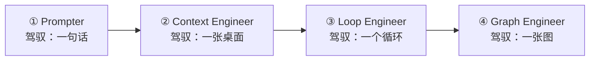

# 4.15 AI 工程师的角色演进：从 Prompter 到 Graph Engineer

最近你可能刷到过两个新词：**Loop Engineer（循环工程师）**、**Graph Engineer（图工程师）**。它们听起来像是新职业，其实是对"会用 AI 的人正在分层"这个现象的描述。

这一节做一件事：把这条**角色光谱**讲清楚。你会发现一个好消息——这些角色干的活，技术上你在前面的章节都学过了。这一节是帮你"对号入座"，看清自己在哪一层、下一层要补什么。

## 一个贯穿全节的类比：从甲方到总工

想象一栋楼的建造过程里，人对"干活的人"的关系有四层：

- **甲方**（Prompter）：提需求——"我要一个三室一厅"。
- **行政主管**（Context Engineer）：给工人准备好办公桌、图纸、工具——工人来了就能干活。
- **项目主管**（Loop Engineer）：带着一个能力强但健忘的工人，反复"布置 → 检查 → 纠偏"，把一件事打磨到合格。
- **总工**（Graph Engineer）：设计整条流水线——哪个工序干什么、谁先谁后、谁和谁并行、交接单怎么写。

注意：**这四层不是四个职业，而是同一个工程师的四种工作模式。** 你写一个 Prompt 时是甲方，你维护 CLAUDE.md 时是行政主管，你带 Claude Code 改 bug 时是项目主管，你设计多 Agent 系统时是总工。区别在于：**你驾驭的对象越来越大**——从一句话，到一张桌面，到一个循环，再到一整张图。



---

## 第一层：Prompter（提示词使用者）

**工作对象**：一句话、一段话。

**核心问题**：这句话怎么写，AI 才听得懂、答得对？

这是所有人起步的地方。这个层级的功夫是：给清楚指令、给例子、控制输出格式——也就是[第 6 章](/ch6-prompt-mastery/)讲的那一整套。

> ⚠️ **常见误解**："Prompt 写得好就是 AI 工程师了。" Prompt 技巧是基本功，但它只解决"单次问答"的质量。真实工作是连续的、多轮的、要带状态的任务——光会写 Prompt，就像只会给工人下单次指令，却不管他干得对不对。

**这一层的天花板**：你很快会发现，同一个 Prompt 有时灵有时不灵。问题往往不在 Prompt 本身，而在 AI 当时"看到了什么"——于是你进入下一层。

---

## 第二层：Context Engineer（上下文工程师）

**工作对象**：模型的上下文窗口——那张"办公桌桌面"。

**核心问题**：每一步，桌面上该摆什么、怎么摆、什么时候清理？

这就是 [4.9 上下文工程](./context-engineering)讲的内容：按需注入、压缩、隔离、用文件系统当外部记忆。到了这一层，你不再纠结"这一句话怎么写"，而是经营"模型在每一轮能看到什么"。

> 💡 这一层的关键词是**经营**：上下文不是一次写好的，而是随着任务推进不断被注入、被压缩、被清理的。行政主管不是把档案室一次性搬上桌，而是每个阶段递上当下最需要的卷宗。

**这一层的天花板**：桌面经营得再好，如果 AI 做错了没人检查、错了没人纠偏，任务照样跑偏。于是你需要设计"循环"——进入第三层。

---

## 第三层：Loop Engineer（循环工程师）

**工作对象**：人机协作的**闭环**。

**核心问题**：目标怎么定义、边界怎么划、结果怎么验证、错了怎么迭代——让"AI 干活"这个循环可控地转下去。

Loop Engineer 干的活，其实就是 [4.7 AI 编程实战工作流](./ai-coding-workflow)那一整套方法论的升华：

```
定义目标（规格先行）
   ↓
AI 执行（小步快跑）
   ↓
客观验证（跑测试 / 跑程序 / 看截图）
   ↓
结果对吗？── 不对 → 把真实反馈贴回去，回到"执行"
   ↓ 对
交付
```

> 💡 **类比**：Loop Engineer 就像带一个能力很强、但健忘且偶尔自信犯错的实习生。你的功夫不在"替他干活"，而在设计那个循环——**任务怎么切、验收标准是什么、反馈怎么给**。循环设计得好，实习生越干越顺；循环设计得差，你们俩互相折磨。

这一层的标志性能力：

- **给反馈闭环，而不是给答案**：让 AI 能自己看到对错（测试、报错、运行结果），而不是靠你肉眼检查每一行
- **小步验证**：每一步都能独立验证，错了立刻知道，而不是攒到最后一起爆
- **知道何时接管**：循环空转三四次还没收敛，果断停下重新讲清楚，或自己上

> ⚠️ **常见误解**："循环就是让 AI 一直重试直到成功。" 没有客观验证手段的重试是空转——AI 会用五种不同的方式犯同一个错。Loop Engineer 设计的第一件事永远是**验证环节**，其次才是重试。

**这一层的天花板**：一个循环管一件事。但真实系统是几十件事交织：有的要并行、有的要审批、有的失败了要续跑。单个循环装不下这些，你需要一张"图"——进入第四层。

---

## 第四层：Graph Engineer（图工程师）

**工作对象**：多节点、多 Agent 的**编排图**。

**核心问题**：整张图的结构——节点怎么切分、边怎么流转、状态怎么共享——让系统结构可控。

这就是 [4.12 AI 工作流编排](./workflow-orchestration)讲的"节点 + 边 + 状态"那套东西，在 2025–2026 年随着 LangGraph 这类框架普及，变成了一个被单独命名的角色。Graph Engineer 的三个核心技能：

| 技能 | 管什么 | 设计糟糕的后果 |
|-----|-------|--------------|
| **Node 设计** | 每个节点干什么、不干什么（职责切分） | 节点又大又杂，一处改处处坏 |
| **Edge 设计** | 控制流：顺序、条件分支、并行、人工介入点 | 流程靠运气走，调试全靠猜 |
| **State Schema 设计** | 跨节点共享什么数据、什么形状、谁来写 | 节点间隐式耦合，系统变成黑盒 |

> 💡 **类比**：Loop Engineer 是带一个下属把一件事打磨好；Graph Engineer 是设计一个部门——谁干什么、谁向谁汇报、交接单怎么写。从"管理循环"到"设计结构"，这是从战术到架构的一跳。

这一层的深入功夫（State Schema 设计原则、并行汇聚、检查点恢复）在下一节 [4.16](./graph-engineering) 专门讲。

---

## 四层光谱总览

| | Prompter | Context Engineer | Loop Engineer | Graph Engineer |
|---|---|---|---|---|
| **驾驭对象** | 一句话 | 上下文窗口 | 人机协作闭环 | 多 Agent 编排图 |
| **核心问题** | 怎么写才听得懂 | 每一步该看见什么 | 怎么验证与纠偏 | 系统结构怎么设计 |
| **失败模式** | 答非所问 | 重点被淹没、忘事 | 空转、跑偏没人发现 | 黑盒、耦合、不可调试 |
| **对应章节** | [第 6 章](/ch6-prompt-mastery/) | [4.9](./context-engineering) | [4.7](./ai-coding-workflow) | [4.12](./workflow-orchestration) → [4.16](./graph-engineering) |

> ⚠️ **常见误解**："Graph Engineer 是最高级，所以前面的不用学。" 恰恰相反——**图里每个节点内部就是一个 Loop，每个 Loop 里都有上下文要经营，每一轮都靠 Prompt 驱动**。四层是嵌套关系，不是替代关系。上层出问题，病根常常在下层。

---

## 怎么给自己定位，往哪进阶

一个简单的自测：

1. 你写的 Prompt 经常"有时灵有时不灵"吗？→ 补第 6 章 + [4.9](./context-engineering)
2. 你能让 AI 自己跑测试、看报错、改到通过吗？→ 不能的话，练 [4.7](./ai-coding-workflow)，这是 Loop Engineer 的核心
3. 你设计的 Agent 系统，每一步走了哪条路、为什么走这条路，你答得上来吗？→ 答不上来，学 [4.12](./workflow-orchestration) 和 [4.16](./graph-engineering)
4. 你的多节点系统出 bug 时，你能单独重跑某个节点、从中断处恢复吗？→ 不能的话，直接进 [4.16](./graph-engineering)

---

## 🛠️ 实战练习：给自己做一次"角色盘点"

拿你最近一个真实用到 AI 的任务，回答四个问题：

1. **Prompter 层**：这个任务里，你写的最关键的一句 Prompt 是什么？它的质量决定了结果的百分之多少？
2. **Context 层**：AI 在干活时"看得见"什么？有没有该给的没给（比如规范、示例）、不该给的给了一大堆？
3. **Loop 层**：任务有没有客观的验证环节（测试、运行、对比）？还是靠你"觉得对了"就过了？
4. **Graph 层**：如果把这个任务交给 3 个 Agent 分工，你会怎么切节点？节点之间要交接什么数据？

**期望结果**：你会发现自己最薄弱的是哪一层——那一层对应的章节，就是你下一步该重读的地方。

**进阶挑战**：把第 4 题画成一张 Mermaid 流程图，标出条件分支和人工介入点。这张图就是你进入 Graph Engineer 视角的第一张草稿。

---

## 📌 关键结论

1. Prompter → Context Engineer → Loop Engineer → Graph Engineer 是同一个工程师驾驭对象的放大：一句话 → 一张桌面 → 一个循环 → 一张图
2. Loop Engineer 的功夫是设计"目标 → 执行 → 验证 → 纠偏"的闭环，核心是**验证环节**而不是重试次数
3. Graph Engineer 的功夫是 Node 切分、Edge 流转、State Schema 三件套，让系统结构可控、可调试
4. 四层是嵌套不是替代：图里有循环，循环里有上下文，上下文里有 Prompt——上层出问题，病根常在下层
5. 定位自己最薄弱的层，重读对应章节，比追新词重要

---

下一节：[4.16 Graph 编排深入：State Schema 与工程化](./graph-engineering)
