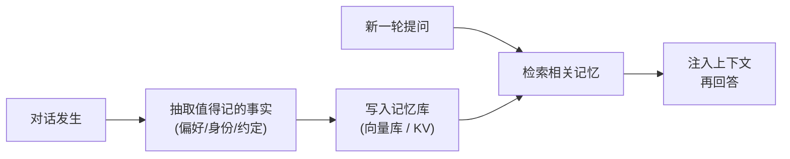

# 4.10 Agent 长期记忆系统

[4.9 上下文工程](./context-engineering) 讲的是怎么经营"这一次任务"的桌面。但很多产品需要 Agent **跨会话**记住东西：上周你说过对花生过敏，这周再问菜谱它该记得；老客户的偏好不该每次从头问。这一节讲怎么给 Agent 装一套长期记忆。

> 💡 **类比**：上下文窗口是 Agent 的**工作记忆**——桌上摊开的东西，会话一结束就清空。长期记忆是它的**笔记本/档案柜**——写下来、收起来，下次需要时再翻出相关的几页摊到桌上。人脑也是这么分工的：你不会把这辈子所有事都同时想着，而是按当下需要回忆。

## 短期 vs 长期：先分清楚

| | 短期记忆（上下文） | 长期记忆（外部存储） |
|---|---|---|
| 存在哪 | 上下文窗口里 | 数据库 / 向量库 / 文件 |
| 生命周期 | 一次会话，结束即清 | 跨会话持久 |
| 容量 | 有限且贵 | 几乎无限 |
| 怎么用 | 直接就在眼前 | 需要时**检索**出来注入上下文 |

> ⚠️ "把整段历史对话全塞进 System Prompt"不是长期记忆，那只是把上下文撑爆。长期记忆的关键动作是**按当前需要，只检索出相关的几条**注入——本质上是一次 [RAG](/ch2-build-products/)，只不过被检索的不是文档，而是"关于这个用户/这件事的记忆"。

---

## 怎么实现：从简单到复杂



**方案一：向量记忆（语义召回）** — 最通用。把每条值得记的内容存成 Embedding，下次按当前问题做语义检索，召回最相关的几条注入。适合"零散的事实、聊过的内容"。

```javascript
// 写入：把一条记忆存进向量库（伪代码，向量库接口见 5.2）
async function remember(userId, text) {
  const vec = await embed(text)
  await memoryDB.insert({ userId, text, vec, ts: Date.now() })
}

// 读取：按当前问题召回最相关的记忆
async function recall(userId, query, k = 3) {
  const qv = await embed(query)
  return memoryDB.search({ filter: { userId }, vector: qv, topK: k })
}

// 用：回答前先把相关记忆注入上下文
async function chat(userId, question) {
  const memories = await recall(userId, question)
  const memText = memories.map(m => `- ${m.text}`).join("\n")
  return llm([
    { role: "system", content: `你是助手。已知关于该用户的记忆：\n${memText || "（暂无）"}` },
    { role: "user", content: question },
  ])
}
```

**方案二：结构化记忆（事实表）** — 对"确定的属性"更靠谱。让模型从对话里抽取出 key-value（`过敏=花生`、`常用语言=中文`），存成普通数据库记录。检索快、可精确更新、可展示给用户管理。适合用户档案、偏好设置。

**方案三：摘要记忆（滚动总结）** — 会话太长时，把旧对话定期总结成一段"用户画像 / 进展摘要"存起来，新会话开头加载。适合长期陪伴型、项目助理型 Agent。

实战里常**组合用**：结构化表存硬事实，向量库存零散内容，摘要存长期画像。

---

## 三个最容易踩的坑

- **该记什么**：别把每句话都存。只记**有长期价值的**（身份、偏好、重要约定、纠正过的错误）。记太多 = 检索噪声，反而召回一堆没用的。让模型显式判断"这条值不值得记"。
- **冲突与更新**：用户说"我改用 Python 了"，旧记忆"常用 JavaScript"就过期了。结构化记忆能直接覆盖；向量记忆要做去重/时间衰减，否则新旧打架。
- **隐私与可控**：长期记忆=长期存用户数据。⚠️ 必须让用户能查看、导出、删除自己的记忆（合规要求），敏感信息（身份证、健康）要评估到底该不该存。

---

## 🛠️ 实战练习：给聊天加一个最小长期记忆

不接向量库，先用一个 JSON 文件当记忆，体会"抽取→存储→召回→注入"这条闭环。

```javascript
import { readFileSync, writeFileSync, existsSync } from "fs"
import OpenAI from "openai"

const client = new OpenAI({ baseURL: "https://api.deepseek.com", apiKey: process.env.DEEPSEEK_API_KEY })
const FILE = "./memory.json"
const load = () => existsSync(FILE) ? JSON.parse(readFileSync(FILE, "utf8")) : []
const save = (m) => writeFileSync(FILE, JSON.stringify(m, null, 2))

// 1. 抽取：让模型判断这句话里有没有值得长期记住的事实
async function extractMemory(userMsg) {
  const res = await client.chat.completions.create({
    model: "deepseek-v4-flash", temperature: 0,
    messages: [
      { role: "system", content: '从用户消息里抽取值得长期记住的个人事实（偏好/身份/约定）。' +
        '有就返回 JSON 数组 ["事实1"]，没有就返回 []。只输出 JSON。' },
      { role: "user", content: userMsg },
    ],
  })
  try { return JSON.parse(res.choices[0].message.content) } catch { return [] }
}

// 2. 回答：把已有记忆全部注入（练习里量小，真实场景要改成语义检索 Top-K）
async function answer(userMsg, memories) {
  const res = await client.chat.completions.create({
    model: "deepseek-v4-flash",
    messages: [
      { role: "system", content: `你是助手。关于用户的记忆：\n${memories.join("\n") || "（暂无）"}` },
      { role: "user", content: userMsg },
    ],
  })
  return res.choices[0].message.content
}

// 跑一轮
const memories = load()
const msg = process.argv[2] || "记一下，我对花生过敏"
const newFacts = await extractMemory(msg)
if (newFacts.length) { memories.push(...newFacts); save(memories); console.log("📝 新记忆:", newFacts) }
console.log("🤖", await answer(msg, memories))
```

**期望结果**：先跑一次"我对花生过敏"，`memory.json` 里出现这条记忆；下次跑"推荐个零食"，模型会避开花生。

**进阶挑战**：把"注入全部记忆"改成"用 Embedding 做语义检索只注入最相关的 3 条"（接上 [5.2 向量库](/ch5-deep-dives/vector-db)），并加一条"遇到冲突信息就更新旧记忆"的逻辑。

---

## 📌 关键结论

1. 短期记忆=上下文（一次会话即清），长期记忆=外部存储（跨会话持久），靠"检索后注入"连接二者
2. 长期记忆本质是一次对"记忆"的 RAG：别全塞进上下文，按当前需要只召回最相关的几条
3. 三种实现：向量记忆（零散内容语义召回）、结构化记忆（硬事实可精确更新）、摘要记忆（长期画像），实战常组合
4. 三大坑：只记有长期价值的（别记噪声）、处理好冲突与更新、给用户查看/删除记忆的权利（隐私合规）
5. 起步可以用一个 JSON/数据库表手搓，跑通"抽取→存储→召回→注入"闭环后再上向量库

---

下一节：[4.11 Computer Use 与浏览器 Agent](./computer-use)
