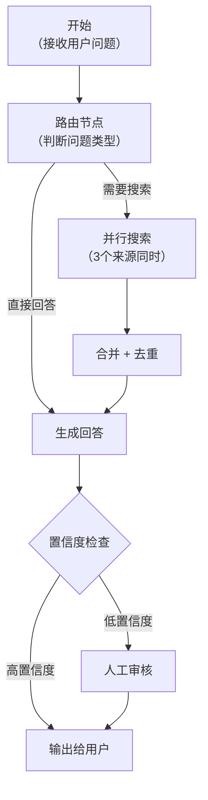

# 4.12 AI 工作流编排

> 💡 **角色视角**：这节讲的内容，就是行业里最近叫 **Graph Engineer（图工程师）** 的人每天做的事——设计节点、边、状态这三要素，让多 Agent 系统的结构可控。它和 Loop Engineer（[4.7](./ai-coding-workflow)，管单个循环）的关系，以及如何进阶，见 [4.15](./engineer-roles)；State Schema 的深入设计见 [4.16](./graph-engineering)。

[4.6 多 Agent 协作](./multi-agent)讲的是"Orchestrator 调度 Subagent"。当任务逻辑更复杂——有条件分支、有并行、有循环、有人工介入点——就需要一套更结构化的编排方式：**工作流（Workflow）**。

> 💡 **ReAct Loop vs Workflow 的区别**：ReAct（见 [2.3](../ch2-build-products/agent-patterns)）让模型**动态决定**下一步做什么；Workflow 是**你事先定义好**执行路径，模型在每个节点上执行具体任务。两者不是对立的——复杂产品往往外层是 Workflow，每个节点内部是一个小 ReAct Agent。

---

## 为什么需要 Workflow

单纯的 ReAct Loop 在以下场景会遇到麻烦：

```
问题一：不可预测的路径
  → 调试难：模型走了哪条路不透明
  → 测试难：无法为每条路写针对性测试

问题二：并行效率
  → ReAct 是串行的：搜资料 → 分析 → 写摘要
  → 如果搜 3 个来源可以同时搜，串行就是浪费

问题三：人工介入
  → 合同审查任务需要人确认再继续
  → ReAct 没有内置的"暂停等人"机制

问题四：长任务的状态持久化
  → 任务跑到一半失败了，要从头来过
  → 需要检查点（Checkpoint）机制
```

---

## 核心概念：节点 + 边 + 状态

工作流本质是一张**有向图**：

```
节点（Node）：一个原子操作（调 LLM、调工具、人工审批、条件判断）
边（Edge）：节点之间的流向（可以是无条件的，也可以是条件路由）
状态（State）：在所有节点间共享的数据，整个工作流的"黑板"
```



---

## 最小工作流引擎实现

不需要引入 LangGraph 等框架，自己写一个够用的工作流引擎：

```javascript
class Workflow {
  constructor(initialState = {}) {
    this.nodes = new Map()         // name → async fn(state) → { state, next }
    this.state = { ...initialState }
  }

  // 注册节点
  addNode(name, fn) {
    this.nodes.set(name, fn)
    return this
  }

  // 运行工作流
  async run(startNode) {
    let current = startNode

    while (current && current !== 'END') {
      const nodeFn = this.nodes.get(current)
      if (!nodeFn) throw new Error(`未知节点：${current}`)

      console.log(`▶ 执行节点：${current}`)
      const result = await nodeFn(this.state)

      // 节点函数返回 { state: 更新后的状态, next: 下一个节点名 }
      this.state = { ...this.state, ...result.state }
      current = result.next
    }

    return this.state
  }
}
```

---

## 实战：构建一个"智能路由问答"工作流

```javascript
const wf = new Workflow({ question: '', answer: '', sources: [] })

// 节点一：路由判断（决定走哪条路）
wf.addNode('router', async (state) => {
  const res = await llm([{
    role: 'user',
    content: `以下问题需要查外部资料还是可以直接回答？只回答 "search" 或 "direct"：\n${state.question}`
  }])
  const intent = res.trim().toLowerCase()
  return {
    state: { intent },
    next: intent === 'search' ? 'search' : 'generate'
  }
})

// 节点二：并行搜索（同时查 3 个来源）
wf.addNode('search', async (state) => {
  const queries = await generateSearchQueries(state.question)  // LLM 生成搜索词
  const results = await Promise.all(queries.map(q => searchWeb(q)))  // 并行搜索
  const sources = results.flat().slice(0, 10)  // 取前 10 条
  return { state: { sources }, next: 'generate' }
})

// 节点三：生成回答
wf.addNode('generate', async (state) => {
  const context = state.sources.length
    ? `参考资料：\n${state.sources.map(s => s.content).join('\n\n')}`
    : ''
  const answer = await llm([
    { role: 'system', content: '根据上下文回答问题，无参考资料则直接回答' },
    { role: 'user', content: `${context}\n\n问题：${state.question}` }
  ])
  return { state: { answer }, next: 'confidence_check' }
})

// 节点四：置信度检查（条件路由）
wf.addNode('confidence_check', async (state) => {
  const check = await llm([{
    role: 'user',
    content: `这个回答的置信度如何？只回答 "high" 或 "low"：\n${state.answer}`
  }])
  const next = check.trim() === 'high' ? 'END' : 'human_review'
  return { state: { confidence: check.trim() }, next }
})

// 节点五：人工审核（等待外部输入）
wf.addNode('human_review', async (state) => {
  // 实际产品里：发通知给人工，等待回调（可用 webhook / 数据库轮询）
  await notifyHumanReview(state)
  const approval = await waitForHumanDecision(state.id)  // 阻塞等待
  return {
    state: { humanApproved: approval.approved, answer: approval.revisedAnswer ?? state.answer },
    next: 'END'
  }
})

// 运行工作流
const result = await wf.run('router')
console.log(result.answer)
```

---

## 四种关键模式

### 1. 顺序执行（Sequential）
最简单，节点 A → B → C，每个节点的输出是下一个节点的输入。

### 2. 条件分支（Conditional Routing）
```javascript
// 节点函数根据状态动态决定 next
wf.addNode('router', async (state) => ({
  state: {},
  next: state.isComplex ? 'deep_analysis' : 'quick_answer'
}))
```

### 3. 并行执行（Parallel）
```javascript
wf.addNode('parallel_search', async (state) => {
  // Promise.all 并行执行，等全部完成再合并
  const [webResults, dbResults, docResults] = await Promise.all([
    searchWeb(state.query),
    searchDB(state.query),
    searchDocs(state.query),
  ])
  return { state: { allSources: [...webResults, ...dbResults, ...docResults] }, next: 'merge' }
})
```

### 4. 带检查点的循环（Loop with Checkpoint）
```javascript
wf.addNode('refine', async (state) => {
  const improved = await improveAnswer(state.answer, state.feedback)
  const iteration = (state.iteration ?? 0) + 1
  // 最多精炼 3 次，或者质量达标就停
  const next = iteration >= 3 || state.qualityScore > 0.9 ? 'END' : 'evaluate'
  return { state: { answer: improved, iteration }, next }
})
```

---

## 状态持久化（让工作流可以从中断处恢复）

长任务可能中途失败。把状态持久化到 DB，支持重启后从检查点继续：

```javascript
class PersistentWorkflow extends Workflow {
  constructor(id, db, initialState) {
    super(initialState)
    this.id = id
    this.db = db
  }

  async run(startNode) {
    // 尝试从数据库恢复
    const saved = await this.db.get(`workflow:${this.id}`)
    if (saved) {
      this.state = saved.state
      startNode = saved.currentNode   // 从上次中断的节点继续
      console.log(`从检查点恢复：节点 ${startNode}`)
    }

    let current = startNode
    while (current && current !== 'END') {
      const nodeFn = this.nodes.get(current)
      const result = await nodeFn(this.state)
      this.state = { ...this.state, ...result.state }
      current = result.next

      // 每个节点执行完就保存检查点
      await this.db.set(`workflow:${this.id}`, { state: this.state, currentNode: current })
    }

    await this.db.delete(`workflow:${this.id}`)   // 完成后清理
    return this.state
  }
}
```

---

## 工作流 vs ReAct：怎么选

| 场景 | 用 ReAct Loop | 用 Workflow |
|-----|--------------|------------|
| 步骤不确定，需要模型自己规划 | ✅ | |
| 步骤固定，逻辑可预测 | | ✅ |
| 需要精确的并行控制 | | ✅ |
| 需要人工介入检查点 | | ✅ |
| 调试时需要每步可追踪 | | ✅ |
| 快速原型 / 简单任务 | ✅ | |
| 长任务需要断点续跑 | | ✅ |

> 💡 **实践建议**：从 ReAct 开始验证可行性，当发现"我需要控制某个分支的确定性"或"某些步骤可以并行"或"需要人工审核"时，把对应部分提取成 Workflow 节点。不必一开始就写完整 Workflow。

---

## 🛠️ 实战练习：把顺序 Agent 改造成带分支的工作流

拿一个你已有的 ReAct Agent，找出其中最常走的 2-3 条不同路径，改造成显式的 Workflow：

1. 画出流程图（手画或 mermaid），标出节点和条件边
2. 用上面的 `Workflow` 类实现，每个节点 10-30 行
3. 分别测试"走路径 A"和"走路径 B"的输入，验证路由正确

**期望结果**：相比原来的 ReAct，工作流版本的每一步更透明、可单独测试。

**进阶挑战**：加一个并行节点（同时做两件事），对比串行版的总耗时。

---

## 📌 关键结论

1. Workflow 适合逻辑可预测的多步任务，ReAct 适合步骤动态决定的任务，两者常叠用
2. 核心结构：节点（任务单元）+ 边（流向）+ 共享状态（黑板）
3. 四种基本模式：顺序、条件分支、并行、带检查点的循环
4. 状态持久化让长任务可以从中断处恢复，避免从头重来
5. 先用 ReAct 原型验证，再把确定性路径提取成 Workflow 节点

---

下一节：[4.13 代码执行沙箱](./code-sandbox)
