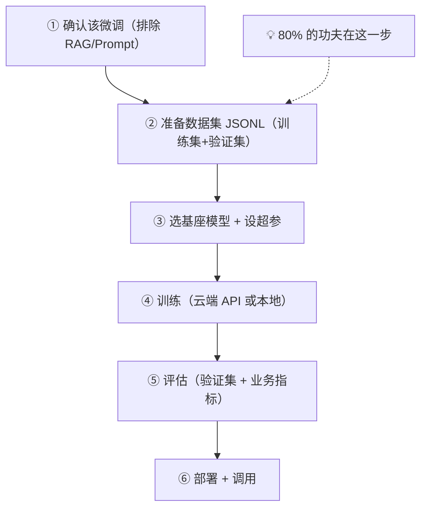

# 5.13 微调·全流程与数据准备

[3.4](/ch3-under-the-hood/finetuning-vs-rag) 讲了**什么时候**该微调（固定风格/格式/任务，且 Prompt 搞不定）。这一节讲**怎么真正做一次微调**——尤其是最关键、也最容易被低估的一步：**数据准备**。

## 微调的完整流程



> ⚠️ 新手最大的误区：以为微调难在"训练"。其实训练就是跑个任务，**真正决定成败的是数据质量**。垃圾数据进，垃圾模型出。

---

## 数据格式：ChatML 的 JSONL

主流平台（百炼、OpenAI 等）的 SFT 数据都是 **JSONL**——一行一个 JSON，每行是一条"对话样本"，用 `messages` 表示：

```jsonl
{"messages":[{"role":"system","content":"你是合同分类助手，只输出类别"},{"role":"user","content":"甲方聘用乙方担任软件工程师，月薪……"},{"role":"assistant","content":"劳动合同"}]}
{"messages":[{"role":"system","content":"你是合同分类助手，只输出类别"},{"role":"user","content":"甲方向乙方采购办公设备一批……"},{"role":"assistant","content":"购销合同"}]}
```

- `system` 放固定指令（每条最好一致）
- `user` 是输入
- `assistant` 是**你希望模型学会的标准输出**（这是监督信号）
- 支持多轮：`messages` 里可以有多组来回

> 💡 **本质**：你在用成百上千个"输入→理想输出"的例子，教模型形成稳定的行为。所以 `assistant` 里的答案必须是你真正想要的样子——它们就是模型要模仿的范本。

---

## 数据准备的几条铁律

**1. 质量 > 数量**：几百条精准、一致的数据，胜过几千条噪声数据。SFT 一般几百到几千条起步。

**2. 一致性**：同类输入的输出风格/格式要统一。你今天标"劳动合同"、明天标"劳动合同（含试用期）"，模型就学乱了。

**3. 覆盖真实分布**：数据要覆盖你线上会遇到的各种情况（包括边界、易错的），别只挑简单的。

**4. 划分训练集 / 验证集**：留出一部分（如 10-20%）**不参与训练**，用来评估"模型在没见过的数据上表现如何"。

```javascript
// 简单划分：打乱后切 10% 作验证集
function split(rows, valRatio = 0.1) {
  const shuffled = [...rows].sort(() => Math.random() - 0.5)
  const n = Math.floor(rows.length * valRatio)
  return { val: shuffled.slice(0, n), train: shuffled.slice(n) }
}
```

**5. 清洗**：去重、去除标注错误的样本——错误样本比没有样本更糟（直接教坏）。

---

## 超参数：先用默认，别瞎调

几个你会见到的参数，起步阶段用平台默认值即可：

| 参数 | 含义 | 起步建议 |
|-----|------|---------|
| n_epochs | 数据被训练几遍 | 2-3（太多会过拟合，把训练集背死） |
| learning_rate | 学习率（学得多激进） | 用默认 |
| batch_size | 每批喂多少条 | 用默认 |
| max_length | 单样本最大长度 | 覆盖你数据的长度 |

> ⚠️ **过拟合**：epochs 太多，模型把训练集"背"下来了，遇到新输入反而变差。验证集表现开始变差就是信号。

---

## 评估：微调完一定要量化

微调完别只"试几条感觉不错"就上。用**验证集**和你的**业务指标**量化（呼应 [2.5](/ch2-build-products/evaluation)）：

- 分类/抽取任务：准确率、F1
- 风格/格式任务：格式合规率、人工抽检
- 和**微调前的基座模型对比**：到底有没有变好？好多少？

```
基座模型（只靠 Prompt）：分类准确率 78%
        ↓ 微调后
微调模型：分类准确率 94%   ← 数字证明值得
```

---

## 🛠️ 实战练习：造一份微调数据集

挑一个**固定输出**的小任务（如把用户反馈分类成"bug/建议/咨询"）：

1. 收集/编造 100 条真实输入
2. 给每条标注理想输出，写成 ChatML 的 JSONL（system 保持一致）
3. 检查一致性：同类输入的输出格式是否统一？有没有标错的？
4. 用上面的 `split` 切出验证集

**期望结果**：你会亲身体会到"数据准备才是微调的主战场"，以及一致性有多重要。这份数据集就是 [5.14](./finetuning-cloud) / [5.15](./finetuning-local) 直接拿去训练的素材。

---

## 📌 关键结论

1. 微调流程：确认该微调 → 备数据 → 训练 → 评估 → 部署，**80% 功夫在数据**
2. 数据是 ChatML 的 JSONL，`assistant` 内容就是你要模型学会的标准输出
3. 数据铁律：质量>数量、一致性、覆盖真实分布、划分验证集、清洗错样本
4. 超参先用默认；epochs 别太多，否则过拟合（把训练集背死）
5. 微调完必须用验证集量化，并和基座模型对比，确认真的变好了

---

下一节：[5.14 微调·用国产平台云端微调](./finetuning-cloud)
