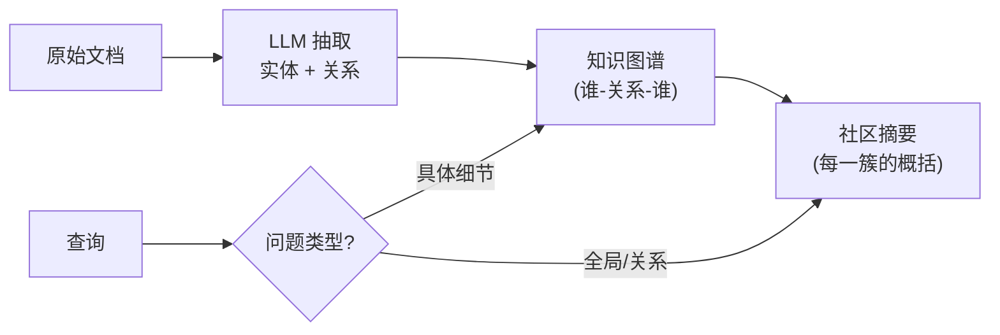

# 5.17 RAG·GraphRAG 与 Agentic RAG

[5.1–5.5](./) 把朴素 RAG 做扎实了：切片、检索、重排、防幻觉。但朴素 RAG 有个天花板——它只会"**捞出几段最相关的片段**"，遇到下面这类问题就抓瞎：

- "这份合同涉及哪几方？他们之间是什么关系？"（**关系型**：答案散在多个片段里，要串起来）
- "把这 50 篇周报总结成本季度的整体趋势。"（**全局型**：没有哪一段是答案，要纵观全部）
- "A 政策和 B 政策有没有冲突？"（**多跳推理**：先找 A、再找 B、再比对）

> 💡 **类比**：朴素 RAG 像在图书馆用关键词找出最相关的几页递给你。但如果问题是"这套书的主线是什么"，找几页是没用的——你需要的是有人**读完全书、画了人物关系图、写了内容提要**。GraphRAG 和 Agentic RAG 就是这两种"超越翻页"的能力。

---

## GraphRAG：先建知识图谱，再检索

核心思路：**别等查询时才临时捞片段，先离线把整个知识库读一遍，用 LLM 抽出"实体 + 关系"建成一张知识图谱**，并对图谱里聚成簇的内容生成"社区摘要"。查询时走图谱和摘要，于是能回答关系型、全局型问题。



- **解决了什么**：跨文档的关系和全局总结，朴素 RAG 的盲区
- **代价**：⚠️ 建图谱要把全部文档喂给 LLM 抽取，**离线建库成本很高**（文档越多越贵），且文档更新后图谱要重建。微软开源的 GraphRAG 是这套方法的代表实现

> ⚠️ 别无脑上 GraphRAG。它是为"全局/关系型问题"准备的重武器。如果你的用户问的大多是"X 怎么操作""Y 的报销标准是多少"这类**有明确出处的具体问题**，朴素 RAG + 重排又快又便宜，上 GraphRAG 纯属浪费。

---

## Agentic RAG：让 Agent 自己决定怎么检索

朴素 RAG 的检索是"**一锤子买卖**"：拿用户问题查一次，不管查得好不好都拿去生成。Agentic RAG 把检索变成 [Agent 的一个工具](/ch2-build-products/agent-patterns)，让模型自己掌控检索过程：

- **查询改写**：用户问得含糊，先把问题改写成更适合检索的表述再查
- **多轮 / 多跳**：第一次没查够，自己换个关键词再查；需要 A 和 B 时分两次查
- **自我判断**：看完召回的片段，自己评估"够不够回答"，不够就继续查，够了才作答

```javascript
// Agentic RAG 的骨架：把"检索"做成工具，让模型循环决定要不要再查
// （这正是 2.11 Capstone "检索作为工具" 的进阶版：从查一次 → 自主多轮）
async function agenticRAG(question, maxRounds = 3) {
  const messages = [
    { role: "system", content: "你要回答用户问题。可调用 search(query) 检索资料。" +
      "资料不足就换个查询再检索；足够了再回答，并标注依据。查不到就说不知道。" },
    { role: "user", content: question },
  ]
  for (let i = 0; i < maxRounds; i++) {
    const res = await llmWithTools(messages, [searchTool])
    if (!res.toolCalls?.length) return res.content        // 模型认为够了，直接作答
    for (const call of res.toolCalls) {                   // 模型决定再查一次（可能改写了 query）
      const docs = await search(call.args.query)
      messages.push({ role: "tool", content: formatDocs(docs) })
    }
  }
  return await llm(messages)   // 到达轮次上限，用已有资料强制作答
}
```

- **解决了什么**：含糊查询、需要多步检索的复杂问题；召回质量差时能自我补救
- **代价**：多轮检索 + 多次模型调用，**更慢更贵**，还要防它在检索循环里打转（设轮次上限，呼应 [2.4 Agent 失控](/ch2-build-products/agent-failure)）

---

## 三者怎么选

| | 朴素 RAG（+重排） | GraphRAG | Agentic RAG |
|---|---|---|---|
| 擅长 | 有明确出处的具体问题 | 全局总结、跨文档关系 | 含糊/多步/多跳的复杂查询 |
| 检索方式 | 查一次 | 走预建的图谱+摘要 | Agent 自主多轮 |
| 成本 | 低 | 建库很贵 | 查询很贵 |
| 复杂度 | 低 | 高（要建图谱） | 中（要 Agent 循环） |

> 落地铁律：**先把朴素 RAG + 重排做到位**（[5.1](./)/[5.3](./rag-eval)），它能解决八成问题。确实卡在"全局/关系型问题"才上 GraphRAG，卡在"含糊/多步查询"才上 Agentic RAG。两者也能叠加用。

---

## 🛠️ 实战练习：把单次检索升级成自主多轮

拿 [2.11 Capstone](/ch2-build-products/capstone) 的"检索作为工具"版本改造：让 Agent 在回答前先自评"资料够不够"，不够就改写查询再检索，最多 3 轮。

**具体步骤：**
1. 在 System Prompt 里加一条规则："看完检索结果先判断是否足够回答；不足就用不同的关键词再次调用 search；足够了再作答。"
2. 把检索循环的轮次上限设为 3，每轮把新召回的内容追加进消息历史
3. 准备两个测试问题：一个能一次查到（如"退货政策是什么"），一个需要多跳（如"A 产品和 B 产品的保修期哪个更长"）
4. 打印每一轮模型实际发出的 `search` query，观察它有没有"改写/换词"

**期望结果**：简单问题 1 轮就答；多跳问题里你能看到模型自己发起了第 2、3 次检索，且查询词在变化。

**进阶挑战**：加一个"检索质量自检"——让模型给每轮召回结果打个 1–5 分的相关性分，低于 3 分才触发再次检索，对比"固定多轮"省了多少次无谓检索。

---

## 📌 关键结论

1. 朴素 RAG 只会"捞片段"，答不了全局型（整体总结）、关系型（跨文档串联）、多跳型问题
2. GraphRAG 离线用 LLM 把文档抽成知识图谱 + 社区摘要，专治全局/关系型问题，代价是建库很贵
3. Agentic RAG 把检索做成 Agent 工具，让模型自主改写查询、多轮多跳、自评够不够，专治含糊/复杂查询
4. 选型铁律：先把朴素 RAG + 重排做到位（解决八成），全局/关系问题才上 GraphRAG，含糊/多步才上 Agentic RAG
5. 两者都更慢更贵，Agentic RAG 还要设轮次上限防打转——别为不存在的复杂度提前买单

---

下一节：[5.6 MCP·三种能力深入与高层 SDK](./mcp-capabilities)
