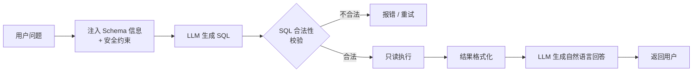

# 5.19 Text-to-SQL：让用户用自然语言查数据库

企业里大量的数据洞察需求，卡在"要写 SQL 才能查"这一步——业务同学不会 SQL，但他们知道自己想要什么。Text-to-SQL 让用户用中文提问，AI 生成 SQL，系统执行并返回结果。

这是 AI 最能快速产生业务价值的场景之一，但也是最容易在生产里翻车的场景之一。这一节把安全、准确、可用三个维度全讲清楚。

---

## 基础流程



---

## 第一步：注入 Schema

AI 不知道你的数据库长什么样，要把表结构告诉它。**Schema 注入是 Text-to-SQL 准确率的最大影响因素。**

```javascript
// 把数据库 Schema 注入到 System Prompt
function buildSystemPrompt(schema) {
  return `你是一个 SQL 专家，只使用 MySQL 语法。
数据库表结构如下：

${schema}

规则：
- 只生成 SELECT 语句，绝对不能生成 INSERT/UPDATE/DELETE/DROP/ALTER
- 只能查询上面列出的表，不能访问系统表（information_schema 等）
- 如果问题无法用现有数据回答，输出 JSON：{"error": "无法回答，原因：xxx"}
- 否则只输出 SQL，不要任何解释文字`
}

// Schema 格式：精简的 CREATE TABLE（不要注释和索引定义，省 Token）
const schema = `
CREATE TABLE orders (
  id INT PRIMARY KEY,
  user_id INT,
  amount DECIMAL(10,2),
  status ENUM('pending','paid','refunded'),
  created_at DATETIME
);

CREATE TABLE users (
  id INT PRIMARY KEY,
  name VARCHAR(100),
  email VARCHAR(200),
  region VARCHAR(50)
);
`
```

**Schema 精简技巧**：

- 只提供 AI 回答这类问题真正需要的表（有些表不相关就不要写进去）
- 加字段注释说明业务含义（`amount -- 实付金额（元）`），比让 AI 猜列名准确得多
- 如果表很多，可以让 AI 先判断需要哪些表，再做第二次精准 SQL 生成

---

## 第二步：生成 SQL

```javascript
async function generateSQL(userQuestion, schema) {
  const res = await client.chat.completions.create({
    model: MODEL,
    messages: [
      { role: 'system', content: buildSystemPrompt(schema) },
      { role: 'user', content: userQuestion }
    ],
    temperature: 0,           // 结构化任务用 temperature=0，减少随机性
    response_format: { type: 'text' }  // 直接输出 SQL 文本
  })

  const output = res.choices[0].message.content.trim()

  // 检查模型是否返回了错误（无法回答）
  if (output.startsWith('{')) {
    try {
      const err = JSON.parse(output)
      if (err.error) return { sql: null, error: err.error }
    } catch (_) {}
  }

  return { sql: output }
}
```

---

## 第三步：SQL 安全校验（关键！）

**绝对不能直接执行 AI 生成的 SQL。** 必须先做校验：

```javascript
function validateSQL(sql) {
  if (!sql) return { valid: false, reason: '空 SQL' }

  const normalized = sql.trim().toUpperCase()

  // 1. 必须是 SELECT
  if (!normalized.startsWith('SELECT')) {
    return { valid: false, reason: '只允许 SELECT 语句' }
  }

  // 2. 禁止危险关键词（即使在子查询里）
  const dangerous = ['INSERT', 'UPDATE', 'DELETE', 'DROP', 'ALTER', 'CREATE',
                     'TRUNCATE', 'EXEC', 'EXECUTE', 'GRANT', 'REVOKE',
                     'INTO OUTFILE', 'LOAD_FILE', 'INFORMATION_SCHEMA']
  for (const keyword of dangerous) {
    if (normalized.includes(keyword)) {
      return { valid: false, reason: `包含禁止关键词：${keyword}` }
    }
  }

  // 3. 结果行数限制（防止 SELECT * 几千万行）
  if (!normalized.includes('LIMIT')) {
    return { valid: false, reason: '必须包含 LIMIT' }
  }

  // 4. 只能查白名单中的表（更严格的方案）
  // 用 SQL parser 解析提取表名，对比白名单
  // const tables = parseTableNames(sql)
  // const allowed = new Set(['orders', 'users'])
  // const unknown = tables.filter(t => !allowed.has(t))
  // if (unknown.length > 0) return { valid: false, reason: `未授权表：${unknown.join(', ')}` }

  return { valid: true }
}
```

> ⚠️ **这是 Text-to-SQL 最重要的安全措施**：校验靠确定性的规则代码，而不是靠 Prompt 里写"不要生成危险 SQL"。模型被注入后完全可能忽略那句话。

---

## 第四步：只读执行 + 结果限制

```javascript
async function executeSQL(sql, db) {
  // 连接只读副本（不是主库）
  // 或者用只有 SELECT 权限的只读账号
  
  const validation = validateSQL(sql)
  if (!validation.valid) {
    throw new Error(`SQL 安全校验未通过：${validation.reason}`)
  }

  // 强制加 LIMIT（防止模型漏写）
  const limitedSQL = sql.replace(/;?\s*$/, '') +
    (sql.toUpperCase().includes('LIMIT') ? '' : ' LIMIT 200')

  try {
    const [rows] = await db.execute(limitedSQL)
    return rows
  } catch (err) {
    // 把数据库错误反馈给 AI，让它修正（见"错误修复"一节）
    throw new SQLError(err.message, { sql: limitedSQL })
  }
}
```

**核心安全原则：**
- 数据库用只读账号（只有 `SELECT` 权限）
- 最好连只读副本，不是主库
- 强制 `LIMIT`（防全表扫描）
- 执行超时设置（防慢查询打垮数据库）

---

## 第五步：生成自然语言回答

SQL 结果是一堆数据行，让 AI 再做一次"把数据翻译成结论"：

```javascript
async function resultsToAnswer(question, sql, rows) {
  if (rows.length === 0) {
    return '没有找到符合条件的数据。'
  }

  const res = await client.chat.completions.create({
    model: MODEL,   // 这里可以用便宜的快速模型
    messages: [{
      role: 'user',
      content: `用户问题：${question}

执行的 SQL：${sql}

查询结果（${rows.length} 条）：
${JSON.stringify(rows.slice(0, 20), null, 2)}
${rows.length > 20 ? `\n（共 ${rows.length} 条，只显示前 20 条）` : ''}

请用自然语言简洁地回答用户的问题，直接给结论，不要重复 SQL 语句。`
    }]
  })

  return res.choices[0].message.content
}
```

---

## SQL 错误的自动修复

模型有时会生成错误的 SQL（表名拼错、函数不存在）。把数据库错误反馈给模型让它修复，比直接报错给用户好得多：

```javascript
async function textToSQLWithRetry(question, schema, db, maxRetries = 2) {
  let lastSQL = null
  let lastError = null

  for (let attempt = 0; attempt <= maxRetries; attempt++) {
    // 第一次正常生成，之后带着错误让模型修复
    const messages = attempt === 0
      ? [{ role: 'system', content: buildSystemPrompt(schema) },
         { role: 'user', content: question }]
      : [{ role: 'system', content: buildSystemPrompt(schema) },
         { role: 'user', content: question },
         { role: 'assistant', content: lastSQL },
         { role: 'user', content: `执行报错：${lastError}。请修正 SQL，只输出修正后的 SQL。` }]

    const { sql, error } = await generateSQL(question, schema, messages)

    if (error) return { answer: error, sql: null }   // 模型说"无法回答"
    if (!sql) continue

    lastSQL = sql

    try {
      const rows = await executeSQL(sql, db)
      const answer = await resultsToAnswer(question, sql, rows)
      return { answer, sql, rows }
    } catch (err) {
      lastError = err.message
      if (attempt === maxRetries) {
        return { answer: '抱歉，查询执行失败，请换一种方式提问。', sql, error: lastError }
      }
    }
  }
}
```

---

## 准确率优化的几个杠杆

| 问题 | 原因 | 优化方法 |
|-----|-----|---------|
| 表名/字段名搞错 | AI 不熟悉你的命名 | Schema 里加注释说明业务含义 |
| 多表 JOIN 写错 | 没告诉 AI 表间关系 | 在 Schema 里说明外键关系 |
| 复杂问题生成的 SQL 语义偏 | 一步生成太难 | 让 AI 先输出"计划"，再生成 SQL（Chain-of-Thought）|
| 日期/时间处理错 | 不知道你的时区/格式 | 在 Schema 里说明时间字段格式，例如 `datetime UTC` |
| 问题超出数据范围 | AI 为了回答而编造 | 强制返回"无法回答"格式，而不是生成乱 SQL |

**Few-shot 示例是最有效的提升手段**：在 System Prompt 里放 3-5 组"问题→正确 SQL"的例子，能显著提升准确率，特别是对你数据库的特殊查询模式。

---

## 评估指标

Text-to-SQL 要有量化评估，别全靠感觉：

| 指标 | 说明 | 目标 |
|-----|-----|-----|
| **Execution Accuracy** | 生成的 SQL 能执行且结果正确的比率 | > 70%（基础），> 85%（生产） |
| **Valid SQL Rate** | 能执行（不报错）的 SQL 比率 | > 90% |
| **Safety Block Rate** | 被安全校验拦截的比率 | 应接近 0（否则模型在尝试危险操作） |
| **Error Recovery Rate** | 出错后自动修复成功的比率 | > 60%（加重试后） |

```javascript
// 建立评估集：用真实的业务问题 + 期望的正确 SQL
const evalSet = [
  { question: '上个月的总销售额是多少？', expectedResult: [{ total: 128400 }] },
  { question: '哪个地区的用户最多？', expectedResult: [{ region: '华东', count: 3200 }] },
  // ...
]

// 定期跑评估，发现模型版本升级或 Schema 变更后准确率下降
async function runEval(evalSet) {
  const results = await Promise.all(evalSet.map(async ({ question, expectedResult }) => {
    const { rows } = await textToSQLWithRetry(question, schema, db)
    const correct = JSON.stringify(rows?.[0]) === JSON.stringify(expectedResult[0])
    return { question, correct }
  }))
  console.log(`准确率：${results.filter(r => r.correct).length} / ${results.length}`)
}
```

---

## 🛠️ 实战练习：给一张业务表做 Text-to-SQL

取你工作中一张真实的业务表（或创建一张 demo 表），跑通完整流程：

1. 写好 Schema（带字段注释），放进 System Prompt
2. 测试 5 个真实业务问题（包含聚合、过滤、多条件的各一个）
3. 用 `validateSQL` 校验每条生成的 SQL，看有没有危险语句
4. 把执行结果喂给 AI，让它生成自然语言结论

**期望结果**：5 个问题里至少 3 个能直接返回正确结论；遇到执行报错时能自动修复。

**进阶挑战**：加 few-shot（3 条示例问题），对比加前后的准确率变化。

---

## 📌 关键结论

1. Schema 注入质量是 Text-to-SQL 准确率的最大变量，字段注释越清晰越准
2. 安全校验必须用确定性代码（正则/白名单），不能靠 Prompt 里的"请不要生成危险 SQL"
3. 用只读账号 + 只读副本 + 强制 LIMIT，从数据库权限层面兜底
4. 把数据库报错反馈给 AI 自修复，显著提升最终成功率
5. 建评估集定期跑 Execution Accuracy，不要靠感觉判断"是不是变好了"

---

下一节：[5.6 MCP·三种能力深入](./mcp-capabilities)
