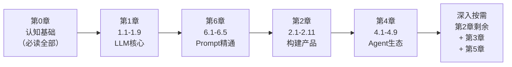

# 学习路径推荐

> 🕐 内容截至 2026-07

这份指南已积累超过 **70 个小节**，从 Token 基础到 Agent 系统，从 Prompt 技巧到模型微调。如果你不确定从哪里开始、哪些必须看、哪些可以跳过，这一页是你的导航中心。

---

## 难度与优先级说明

| 标记 | 含义 | 适合谁 |
|-----|------|-------|
| 🟢 **入门** | 概念为主，无需太多工程背景 | 刚接触 AI 开发的工程师 |
| 🟡 **进阶** | 需要有 API 调用经验，有代码量 | 已经用过 AI API 的工程师 |
| 🔴 **深入** | 需要扎实工程背景，系统设计经验 | 要做 AI 基础设施或专题深入的工程师 |

| 标记 | 含义 |
|-----|------|
| ⭐ **必读** | 不看这节就缺了核心拼图，所有 AI 工程师都应该读 |
| 📌 **推荐** | 构建生产级系统时必须了解，建议在入门后尽快补上 |
| 💡 **选读** | 特定场景下才需要，或想深入原理时才看 |

---

## 各章节难度与优先级一览

### 第 0 章 · 建立正确认知

| 小节 | 难度 | 优先级 | 核心价值 |
|-----|------|-------|---------|
| [0.1 AI 到底是什么](/ch0-mindset/) | 🟢 | ⭐ | 打破对 AI 的误解，建立正确心智模型 |
| [0.2 LLM 在做什么事](/ch0-mindset/what-llm-does) | 🟢 | ⭐ | 理解"下一个词预测"的本质，避免大量常见错误 |
| [0.3 AI 能做什么，不能做什么](/ch0-mindset/capabilities) | 🟢 | ⭐ | 知道边界，才能正确使用 |
| [0.4 当前技术版图](/ch0-mindset/landscape) | 🟢 | ⭐ | 不同工具、不同模型的关系 |
| [0.5 国产大模型生态](/ch0-mindset/china-llm) | 🟢 | 📌 | 国内可用的模型和平台 |

### 第 1 章 · LLM 工程精通

| 小节 | 难度 | 优先级 | 核心价值 |
|-----|------|-------|---------|
| [1.1 Token 与上下文](/ch1-llm-engineering/) | 🟢 | ⭐ | 理解 AI 计价和上下文限制的底层逻辑 |
| [1.2 系统性 Prompt 工程](/ch1-llm-engineering/prompt-engineering) | 🟢 | ⭐ | 写出稳定有效 Prompt 的方法论 |
| [1.3 生成参数详解](/ch1-llm-engineering/parameters) | 🟢 | ⭐ | temperature/top-p 等参数实际意义 |
| [1.4 Tool Use 深度使用](/ch1-llm-engineering/tool-use) | 🟡 | ⭐ | Agent 的核心能力，最重要的 1 章 |
| [1.5 多轮对话与状态管理](/ch1-llm-engineering/conversation) | 🟡 | ⭐ | 对话历史、上下文压缩的正确姿势 |
| [1.6 流式输出与成本控制](/ch1-llm-engineering/streaming-cost) | 🟡 | 📌 | 生产体验和成本不可忽视 |
| [1.7 推理模型与思考模式](/ch1-llm-engineering/reasoning-models) | 🟡 | 📌 | o1/Claude 推理模型的正确使用场景 |
| [1.8 多模态：图像与文档输入](/ch1-llm-engineering/multimodal) | 🟡 | 📌 | 越来越多的场景需要视觉理解 |
| [1.9 OpenAI 兼容协议与多模型切换](/ch1-llm-engineering/openai-compatible) | 🟢 | ⭐ | 一套代码适配所有主流模型 |
| [1.10 在本地跑模型（Ollama）](/ch1-llm-engineering/local-models) | 🟡 | 📌 | 数据安全场景、本地开发必备 |
| [1.11 图像与视频生成](/ch1-llm-engineering/image-video-gen) | 🟡 | 💡 | 多模态输出，按需了解 |
| [1.12 语音与实时（ASR/TTS）](/ch1-llm-engineering/voice-realtime) | 🟡 | 💡 | 语音产品专用 |
| [1.13 自托管推理部署](/ch1-llm-engineering/self-hosting) | 🔴 | 💡 | 规模化部署，基础设施工程师必读 |
| [1.14 结构化输出的可靠实践](/ch1-llm-engineering/structured-output) | 🟡 | ⭐ | 生产 AI 功能几乎都需要结构化输出 |
| [1.15 Embedding 模型选型指南](/ch1-llm-engineering/embedding-models) | 🟡 | 📌 | RAG 系统的地基，不能乱选 |

### 第 2 章 · 构建 AI 产品

| 小节 | 难度 | 优先级 | 核心价值 |
|-----|------|-------|---------|
| [2.1 RAG 完整 Pipeline](/ch2-build-products/) | 🟡 | ⭐ | 最常用的 AI 应用架构 |
| [2.2 向量与语义搜索](/ch2-build-products/embedding-search) | 🟡 | ⭐ | 理解相似度搜索的原理和实现 |
| [2.3 Agent 设计模式](/ch2-build-products/agent-patterns) | 🟡 | ⭐ | ReAct/Planning/Handoff，可跑代码 |
| [2.4 为什么 Agent 会失控](/ch2-build-products/agent-failure) | 🟡 | ⭐ | 避开已知坑，比踩坑再修便宜 10 倍 |
| [2.5 AI 系统的评估方法](/ch2-build-products/evaluation) | 🟡 | ⭐ | 没有评估就没有方向 |
| [2.6 生产环境的坑](/ch2-build-products/production) | 🟡 | ⭐ | 上线后才会踩的坑，提前了解 |
| [2.7 AI 应用安全](/ch2-build-products/security) | 🟡 | ⭐ | Prompt 注入等攻击，不懂就是漏洞 |
| [2.8 成本估算实操](/ch2-build-products/cost-estimation) | 🟢 | 📌 | 估算 Token 成本，避免账单惊喜 |
| [2.9 可观测性与线上监控](/ch2-build-products/observability) | 🟡 | 📌 | 生产系统必备的可观测能力 |
| [2.10 AI 功能安全上线](/ch2-build-products/safe-launch) | 🟡 | 📌 | 灰度上线、回滚策略 |
| [2.11 实战项目：知识库问答 Agent](/ch2-build-products/capstone) | 🟡 | 📌 | 端到端实战，前面章节的综合演练 |
| [2.12 AI 产品的 UX 设计模式](/ch2-build-products/ai-ux) | 🟡 | 📌 | 流式UX、错误处理、渐进式披露 |
| [2.13 语义缓存](/ch2-build-products/semantic-cache) | 🟡 | 💡 | 高频相似查询场景的成本优化 |
| [2.14 限流、重试与熔断](/ch2-build-products/retry-ratelimit) | 🟡 | 📌 | 生产系统的韧性保障 |
| [2.15 Guardrails 输出防护实战](/ch2-build-products/guardrails) | 🟡 | 📌 | 三层防护，合规场景必读 |
| [2.16 AI 对话设计模式](/ch2-build-products/conversation-design) | 🟡 | 💡 | 槽位填充、实体追踪，对话产品专用 |
| [2.17 AI 测试工程](/ch2-build-products/ai-testing) | 🟡 | 📌 | 黄金数据集、CI 回归，可持续维护的前提 |
| [2.18 数据飞轮](/ch2-build-products/data-flywheel) | 🟡 | 💡 | 用生产数据持续改进，中后期产品必读 |

### 第 3 章 · 理解引擎盖下面

> 💡 这一章是"懂原理"的选修课——不看也能构建好产品，但看了之后很多"奇怪现象"会豁然开朗。

| 小节 | 难度 | 优先级 | 核心价值 |
|-----|------|-------|---------|
| [3.1 Transformer 是什么](/ch3-under-the-hood/) | 🟡 | 📌 | 读懂论文和技术文章的基础 |
| [3.2 Attention 机制的直觉](/ch3-under-the-hood/attention) | 🟡 | 💡 | 理解模型"注意力"的比喻 |
| [3.3 模型是怎么训练出来的](/ch3-under-the-hood/training) | 🟡 | 📌 | 理解 RLHF、SFT，选模型的依据 |
| [3.4 Fine-tuning vs RAG](/ch3-under-the-hood/finetuning-vs-rag) | 🟡 | ⭐ | 最重要的选型决策之一 |
| [3.5 怎么读 AI 论文](/ch3-under-the-hood/read-papers) | 🟢 | 💡 | 跟上前沿的能力 |
| [3.6 位置编码与长上下文](/ch3-under-the-hood/context-window-limits) | 🔴 | 💡 | 理解"中间迷失"现象的底层 |
| [3.7 量化与模型压缩](/ch3-under-the-hood/quantization) | 🟡 | 💡 | 本地部署和成本优化必读 |

### 第 4 章 · MCP 与 Agent 生态

| 小节 | 难度 | 优先级 | 核心价值 |
|-----|------|-------|---------|
| [4.1 MCP 是什么，为什么重要](/ch4-agent-mcp/) | 🟢 | ⭐ | AI 工具生态的新标准 |
| [4.2 用现有 MCP Server](/ch4-agent-mcp/use-mcp) | 🟢 | ⭐ | 零代码接入大量现成能力 |
| [4.3 自己写 MCP Server](/ch4-agent-mcp/build-mcp) | 🟡 | 📌 | 封装自己的业务能力给 AI 用 |
| [4.4 Claude Code 深度使用](/ch4-agent-mcp/claude-code) | 🟢 | ⭐ | AI 编程助手的正确打开方式 |
| [4.5 Skill 与 Harness 机制](/ch4-agent-mcp/skill-harness) | 🔴 | 💡 | Claude Code 内部机制，高级用户 |
| [4.6 多 Agent 协作](/ch4-agent-mcp/multi-agent) | 🔴 | 💡 | 复杂任务的多智能体分工 |
| [4.7 AI 编程实战工作流](/ch4-agent-mcp/ai-coding-workflow) | 🟢 | ⭐ | 提升编程效率的实战方法 |
| [4.8 Agent = Model + Harness](/ch4-agent-mcp/harness-engineering) | 🟡 | 📌 | 决定 Agent 上限的 7 个工程组件 |
| [4.9 上下文工程](/ch4-agent-mcp/context-engineering) | 🟡 | 📌 | 长任务 Agent 的核心能力 |
| [4.10 Agent 长期记忆系统](/ch4-agent-mcp/long-term-memory) | 🔴 | 💡 | 跨会话记忆，高级 Agent 功能 |
| [4.11 Computer Use 与浏览器 Agent](/ch4-agent-mcp/computer-use) | 🔴 | 💡 | GUI 操作，前沿能力 |
| [4.12 AI 工作流编排](/ch4-agent-mcp/workflow-orchestration) | 🔴 | 💡 | 复杂多步骤流程的自动化 |
| [4.13 代码执行沙箱](/ch4-agent-mcp/code-sandbox) | 🔴 | 💡 | 安全执行 AI 生成代码 |
| [4.14 多模态 Agent：视觉理解 + 行动](/ch4-agent-mcp/multimodal-agent) | 🟡 | 💡 | 截图分析、图表提取、视觉 Agent |
| [4.15 角色演进：Prompter 到 Graph Engineer](/ch4-agent-mcp/engineer-roles) | 🟢 | 📌 | Loop/Graph Engineer 是什么，给自己定位 |
| [4.16 Graph 编排深入：State Schema](/ch4-agent-mcp/graph-engineering) | 🔴 | 💡 | 多节点系统的状态设计内功 |
| [4.17 极简 Harness 解剖：Pi](/ch4-agent-mcp/pi-harness) | 🔴 | 💡 | 从 Pi 看 Harness 设计的另一条路线 |

### 第 5 章 · 四大专题深入

> 这一章按需查阅——不是主线，而是你真正要落地某个方向时的深水区。

| 专题组 | 难度 | 优先级 | 适合谁 |
|-------|------|-------|-------|
| RAG 进阶（5.1–5.5, 5.17, 5.19, 5.20） | 🔴 | 📌 | 构建生产 RAG 系统 |
| MCP 进阶（5.6–5.9） | 🔴 | 💡 | 做 MCP Server 生产化 |
| Skill（5.10–5.12） | 🔴 | 💡 | 封装可复用 AI 能力 |
| 模型微调（5.13–5.16, 5.18） | 🔴 | 💡 | 真正要微调模型时再看 |

### 第 6 章 · 提示词工程精通

| 小节 | 难度 | 优先级 | 核心价值 |
|-----|------|-------|---------|
| [6.1 提示词到底在调什么](/ch6-prompt-mastery/) | 🟡 | ⭐ | 提示词工程的思维框架 |
| [6.2 提示词的解剖](/ch6-prompt-mastery/anatomy) | 🟡 | ⭐ | 系统性拆解一个 Prompt 的结构 |
| [6.3 推理与示例技巧深入](/ch6-prompt-mastery/reasoning) | 🟡 | ⭐ | CoT、Few-shot 的正确用法 |
| [6.4 控制输出](/ch6-prompt-mastery/output-control) | 🟡 | 📌 | 格式、长度、风格控制 |
| [6.5 让提示词稳定可靠](/ch6-prompt-mastery/reliability) | 🟡 | ⭐ | 减少随机性，让 Prompt 可预期 |
| [6.6 迭代与评估方法论](/ch6-prompt-mastery/iteration) | 🟡 | 📌 | 如何系统地改进 Prompt |
| [6.7 场景·信息处理](/ch6-prompt-mastery/playbook-info) | 🟡 | 💡 | 摘要、抽取、分类场景的 playbook |
| [6.8 场景·代码与技术](/ch6-prompt-mastery/playbook-code) | 🟡 | 💡 | 代码生成、审查、调试的 playbook |
| [6.9 场景·对话客服与 RAG/Agent](/ch6-prompt-mastery/playbook-chat-rag) | 🟡 | 💡 | 对话和 RAG 场景的 playbook |
| [6.10 模型差异与反模式清单](/ch6-prompt-mastery/model-differences) | 🟡 | 💡 | 不同模型的坑和反模式清单 |

---

## 三条推荐路线

### 路线一：快速上手（约 2 周）

**目标**：能在 2 周内开始构建第一个 AI 功能，遇到问题知道去哪查。

```
第 1-2 天（认知基础）
  ✓ 第 0 章全部（0.1-0.4）
  
第 3-5 天（LLM 工程核心）
  ✓ 1.1 Token 与上下文
  ✓ 1.2 Prompt 工程
  ✓ 1.3 生成参数
  ✓ 1.9 OpenAI 兼容协议
  ✓ 1.14 结构化输出

第 6-9 天（构建产品）
  ✓ 2.1 RAG Pipeline
  ✓ 2.2 向量搜索
  ✓ 2.3 Agent 设计模式
  ✓ 2.4 为什么 Agent 会失控
  ✓ 2.5 评估方法
  ✓ 2.7 AI 应用安全

第 10-11 天（提示词 + 工具）
  ✓ 6.1-6.3 提示词工程（前三节）
  ✓ 6.5 让提示词稳定可靠
  ✓ 4.4 Claude Code 使用
  ✓ 4.7 AI 编程工作流

第 12-14 天（动手）
  ✓ 2.11 实战项目：知识库问答 Agent
  随时查：词汇手册、提示词模板速查
```

完成后你能做到：写稳定的 Prompt、调用 LLM API、搭基础 RAG、跑通第一个 Agent。

---

### 路线二：系统掌握（约 1-2 个月）

**目标**：全面掌握 AI 工程技能，能独立负责生产级 AI 系统。



**节奏建议：**
- 每天 1-2 个小节（含代码实验）
- 每章结束后做一遍速记卡和自测题
- 发现卡壳时才回到第 3 章查原理

**第 1-2 章剩余内容的顺序：**
先读完 2.1-2.11（核心），再按需补：2.12 UX → 2.14 限流重试 → 2.15 Guardrails → 2.17 测试工程 → 2.18 数据飞轮。

---

### 路线三：按目标专题

根据你最关心的方向，走对应的专题路线：

#### 🎯 要做 RAG 系统

```
0章认知 → 1.1/1.2/1.4/1.9/1.14/1.15 → 2.1/2.2/2.5 → 5.1-5.5（RAG进阶全部）→ 5.17/5.19 → 2.17（测试）
```

#### 🎯 要做 AI Agent

→ 直接看 [Agent 学习路径](/agent-path)，那一页是专门为 Agent 学习者规划的串联路线。

#### 🎯 要做本地/私有化部署

```
0章 → 1.9/1.10/1.13/1.15 → 3.7（量化）→ 2.9（监控）→ 5.15（本地LoRA+Ollama）
```

#### 🎯 提示词工程师 / LLM 产品经理

```
0章全部 → 1.1-1.3/1.14 → 第6章全部 → 5.20（DSPy/APO）→ 2.5/2.17
```

#### 🎯 基础设施工程师（要把 AI 系统在公司跑起来）

```
0章 → 1.9/1.13/1.6 → 2.6/2.7/2.9/2.10/2.14/2.15 → 3.7 → 1.10/1.13 → 2.17/2.18
```

#### 🎯 只想用 Claude Code 提高开发效率

```
4.4 → 4.7 → 4.9 → 1.2（Prompt基础）→ 4.5（Skill机制）
```

---

## 给不同背景读者的建议

| 你的背景 | 注意点 |
|---------|-------|
| **纯前端工程师** | 代码示例全用 JS/Node.js，应该没语言障碍。重点先搞懂异步/流式输出（1.6），再学 Tool Use（1.4） |
| **后端工程师** | API 调用对你轻松，重点放在 Prompt 工程（第1章）和架构决策（第2章）上 |
| **数据工程师** | 第3章原理部分对你较友好，但不要陷进去——工程实践（第2章）更值得优先投入 |
| **产品经理** | 第0章是必读精华，2.12 UX 和 2.5 评估方法对产品决策帮助最大。第3章可以选读 3.4 |
| **完全没有 AI 经验** | 严格按顺序：第0章 → 第1章 1.1-1.5 → 词汇表查不懂的词。不要跳跃 |
| **已在生产环境用过 AI API** | 快速扫过第0章和 1.1-1.3，重点放在 1.4/1.14 + 第2章 2.3-2.7 |

---

## 快速判断：这节要不要现在看？

```
问题 1：这节是「必读」（⭐）吗？
  → 是：现在就看
  → 不是：问问题 2

问题 2：你正在构建会用到这节的功能吗？
  → 是：现在看
  → 不是：问问题 3

问题 3：这节是「推荐」（📌）且你有时间吗？
  → 是：加入计划，1 周内看
  → 不是：加入书签，需要时再来查
```

---

## 📌 关键结论

1. 全书 70 多节，⭐必读约 25 节，是所有 AI 工程师的核心共同基础
2. 快速上手路线（约 2 周）：第0章 + 1.1-1.5/1.9/1.14 + 2.1-2.7 + 6.1-6.5 + 4.4/4.7
3. 第3章是选修——卡壳了回来看，不要一开始就钻原理
4. 第5章是深水区——真正要落地某方向时再进，不要全部顺序读
5. 不同方向有专题路线（RAG / Agent / 本地部署 / 提示词 / 基础设施），按目标走最高效
